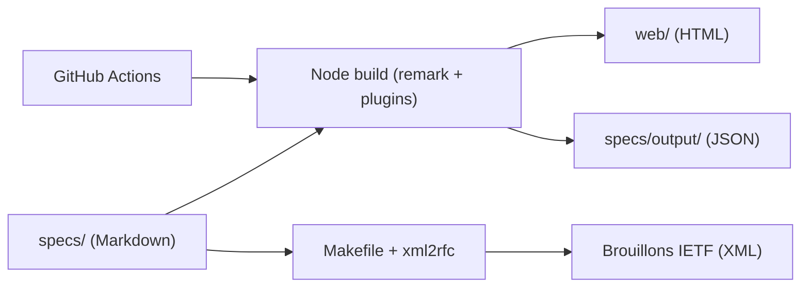

# json-schema-org/json-schema-spec

> Sources des prochains brouillons IETF de la spécification JSON Schema, pour relecteurs et implémenteurs.

## Le problème
Valider et documenter des documents JSON demande un vocabulaire commun, publié et versionné.

## Ce que ça fait vraiment
Dépôt de travail des spécifications en Markdown (`specs/`), avec décisions d'architecture (`adr/`). Une chaîne Node (remark, rehype et plugins maison) produit le HTML et des sorties JSON ; une chaîne Python (Makefile, xml2rfc) produit les brouillons IETF. CI GitHub Actions. Tests du méta-schéma avec `npm test`.

## Comment c'est branché


## Essayer
```bash
npm run build -- specs
npm run build -- specs/jsonschema-core.md
npm run build-ietf
npm test
```

## Coût et pièges
Gratuit. Les versions publiées sont sur le site du projet, pas dans ce dépôt de travail. Licence « présente mais non identifiée » : à lire avant de réutiliser le texte.

## Ce que ce n'est pas
Pas une bibliothèque de validation : les tests de conformité et le site ont leurs propres dépôts.

## Alternatives
Aucune alternative nommée dans le README.

## Pour toi
À surveiller : à consulter comme référence quand tu écris des schémas de données ou de configuration ; inutile à cloner sauf pour contribuer.

