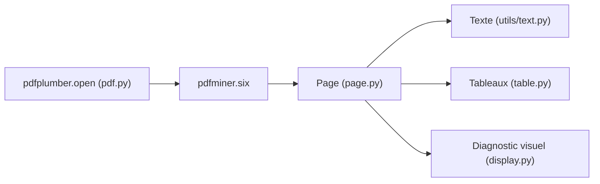

# jsvine/pdfplumber

> Bibliothèque Python qui extrait texte, tableaux et objets de PDF générés par machine, avec débogage visuel.

## Le problème
Récupérer proprement des tableaux et du texte positionné dans un PDF est fastidieux, et on ne voit pas pourquoi l'extraction échoue.

## Ce que ça fait vraiment
Bâti sur `pdfminer.six`, il expose chaque caractère, ligne, rectangle, courbe, image et lien sous forme de dictionnaires. Il extrait texte (avec mise en page optionnelle), mots, recherches par regex, et tableaux (stratégies `lines`, `text`, `explicit`). `to_image()` dessine les objets détectés pour régler les paramètres. Une CLI sort du CSV, du JSON ou du texte.

## Comment c'est branché


## Essayer
```bash
pip install pdfplumber
curl "https://raw.githubusercontent.com/jsvine/pdfplumber/stable/examples/pdfs/background-checks.pdf" > background-checks.pdf
pdfplumber background-checks.pdf > background-checks.csv
```

## Coût et pièges
Gratuit. Le cache de pages peut consommer beaucoup de mémoire sur de gros PDF : `Page.close()` le libère. Certains attributs sont marqués expérimentaux dans le README.

## Ce que ce n'est pas
Pas un OCR : il fonctionne mal sur des PDF scannés. Il ne génère ni ne modifie de PDF. Les formulaires n'ont pas d'interface dédiée.

## Alternatives
pymupdf (plus rapide, mais licence AGPL et dépendance MuPDF), camelot, tabula-py et pdftables (centrés tableaux), pdfminer.six (base seule), PyPDF2.

## Pour toi
À adopter : outil de référence pour alimenter un pipeline de données avec des tableaux de PDF machine, avec un débogage visuel qui fait gagner du temps.

