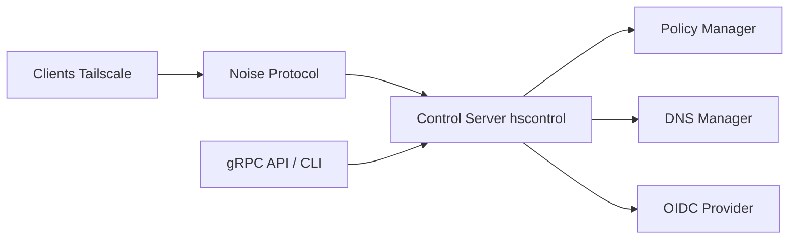

# juanfont/headscale

> Serveur de contrôle Tailscale open source et auto-hébergé, pour un seul réseau privé de labo ou petite équipe.

## Le problème
Le serveur de contrôle de Tailscale est fermé : relier des machines par un VPN WireGuard oblige à passer par le service de l'éditeur.

## Ce que ça fait vraiment
Headscale échange les clés publiques WireGuard des nœuds, attribue leurs adresses IP, sépare les utilisateurs, permet de partager des machines et expose les routes annoncées. Il vise volontairement un seul tailnet, pour particuliers, labos ou petites organisations open source. D'après l'architecture : contrôle `hscontrol`, protocole Noise, DERP, politiques d'accès, DNS, OIDC, API gRPC et CLI.

## Comment c'est branché


## Essayer
```bash
nix develop
make generate
make test
make build
```

## Coût et pièges
Gratuit ; images de conteneur et binaires existent, mais le README dit ne ni soutenir ni encourager reverse proxies et conteneurs. Prendre le tag de la version utilisée pour avoir la bonne configuration d'exemple. Un mainteneur actif est employé par Tailscale (contributions relues par les autres).

## Ce que ce n'est pas
Pas associé à Tailscale Inc., et pas un service multi-tailnets : le périmètre est étroit par conception. Les clients graphiques Windows/macOS/iOS restent propriétaires selon le README.

## Alternatives
- Tailscale : le service officiel, dont le serveur de contrôle est fermé.

## Pour toi
Surveiller : utile pour relier en privé des machines GPU et des serveurs de données sans compte chez l'éditeur, à condition d'accepter de l'exploiter toi-même.

