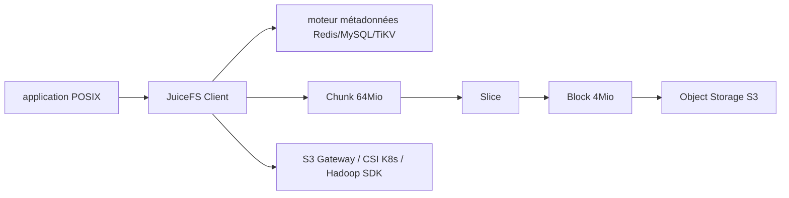

# juicedata/juicefs

> Système de fichiers POSIX dont les données vivent dans un stockage objet.

## Le problème
Le stockage objet est bon marché et sans limite, mais les applications data et ML
attendent un système de fichiers POSIX, pas une API S3.

## Ce que ça fait vraiment
Sépare données et métadonnées : les données partent dans un stockage objet (S3 et
compatibles, disque local, HDFS), les métadonnées dans un moteur au choix — Redis,
MySQL, SQLite, TiKV. Chaque fichier est découpé en Chunks de 64 Mio au plus,
composés de Slices de longueur variable, eux-mêmes faits de Blocks de 4 Mio stockés
dans l'objet. Compatible POSIX (8813 tests pjdfstest passés), compatible Hadoop 2.x
et 3.x via un SDK Java, passerelle S3, driver CSI Kubernetes. Partageable par des
milliers de clients avec cohérence forte : une modification confirmée est
immédiatement visible sur tous les points de montage. Verrous globaux BSD (flock) et
POSIX (fcntl), chiffrement en transit et au repos, compression LZ4 ou Zstandard.

## Comment c'est branché


## Essayer
```bash
juicefs mount --no-usage-report
```

## Coût et pièges
Apache 2.0, gratuit. Il faut fournir deux services : un moteur de métadonnées et un
bucket objet — leur disponibilité devient celle du système de fichiers. Avec Redis
Cluster, toutes les clés d'une transaction doivent tomber dans le même hash slot,
donc un système de fichiers n'utilise qu'un seul slot. Collecte anonyme de métriques
(numéro de version) activée par défaut, désactivable par `--no-usage-report`.

## Ce que ce n'est pas
Ce n'est pas une vue sur des fichiers existants dans un bucket : les fichiers sources
sont découpés et n'apparaissent pas dans le navigateur du stockage objet, seulement
un répertoire `chunks` et des fichiers numérotés. Pas de récupération possible sans
les métadonnées.

## Alternatives
- EFS et S3FS : comparés dans les benchmarks de débit et d'IOPS métadonnées.
- MooseFS, HDFS, Google File System : cités comme sources d'inspiration du design.

## Pour toi
La bonne réponse quand un entraînement ou un pipeline doit lire un dataset en POSIX
mais qu'on veut payer du stockage objet.
