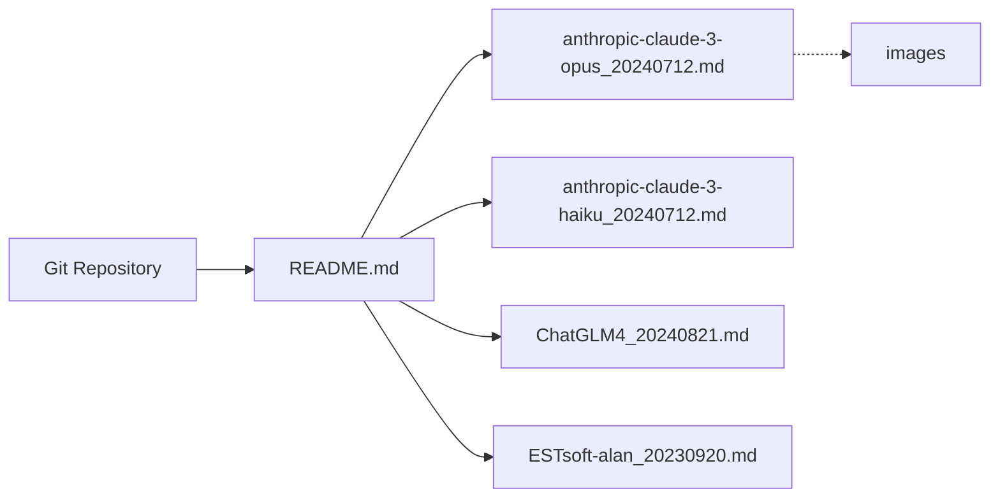

# jujumilk3/leaked-system-prompts

> Collection de prompts système fuités de services LLM grand public, pour étude et comparaison.

## Le problème
Les prompts système des assistants commerciaux sont opaques ; les étudier aide à comprendre leurs garde-fous et styles.

## Ce que ça fait vraiment
Fichiers Markdown, un par prompt, nommés modèle + date (ex. `anthropic-claude-3-opus_20240712.md`).
Les contributions doivent citer une source vérifiable ou un prompt reproductible.
Pas de code, pas d'outillage : un dépôt de documents indexé par le README.

## Comment c'est branché

## Essayer
Aucune commande documentée.

## Coût et pièges
Gratuit. Aucune licence déclarée : réutilisation juridiquement floue, contenu issu de fuites.

## Ce que ce n'est pas
Pas une source officielle ni garantie à jour ; l'auteur évite tout code commercial sensible pour limiter les DMCA.

## Alternatives
Aucune alternative nommée dans le README.

## Pour toi
À surveiller comme référence de lecture pour écrire tes propres prompts système, sans rien y construire vu l'absence de licence.
