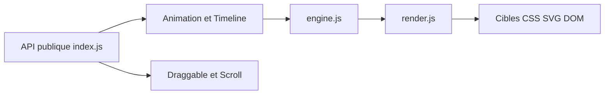

# juliangarnier/anime

> Bibliothèque JavaScript d'animation pour CSS, SVG, attributs DOM et objets JS, destinée aux développeurs front.

## Le problème
Animer des éléments d'une page (déplacements, séquences, défilement) avec du CSS pur devient vite difficile à orchestrer.

## Ce que ça fait vraiment
Anime.js v4 s'importe en modules ES : `animate`, `stagger`, avec chronologies (timeline), minuteurs, easings, déplacement à la souris (draggable), événements de défilement, portées, mise en page automatique, outils SVG et texte, WAAPI et un adaptateur Three.js. Le moteur fait tourner une boucle de rafraîchissement et rend les valeurs sur les cibles.

## Comment c'est branché


## Essayer
```javascript
import {
  animate,
  stagger,
} from 'animejs';

animate('.square', {
  x: 320,
  rotate: { from: -180 },
  duration: 1250,
  delay: stagger(65, { from: 'center' }),
  ease: 'inOutQuint',
  loop: true,
  alternate: true
});
```

## Coût et pièges
Gratuit. La v4 diffère de la v3 : un guide de migration existe.

## Ce que ce n'est pas
Ce n'est pas une bibliothèque de visualisation de données ni un moteur de graphiques.

## Alternatives
Aucune alternative nommée dans le README.

## Pour toi
Ignorer : c'est de l'animation d'interface, sans lien avec tes travaux de données ou d'IA, sauf si tu bâtis un front de démonstration.

