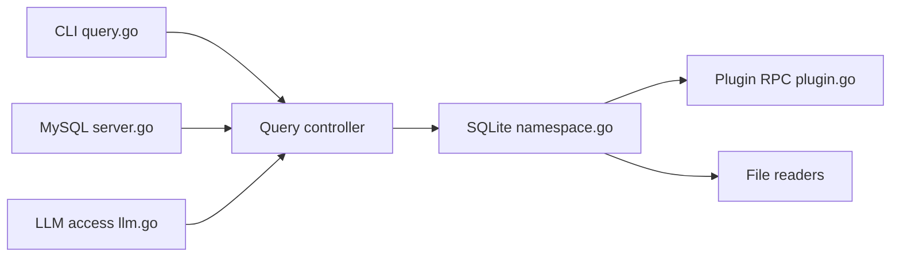

# julien040/anyquery

> Moteur SQL sur SQLite pour interroger fichiers, bases et applications via plugins, avec accès MCP pour LLM.

## Le problème
Croiser des données dispersées (fichiers, Notion, Apple Notes, bases) demande autant de scripts ou d'exports.

## Ce que ça fait vraiment
Un moteur SQL construit sur SQLite qui lit fichiers, bases de données et applications via des plugins (registre officiel, extensions SQLite acceptées). Shell interactif, serveur compatible MySQL (TablePlus, Metabase…), et serveur MCP (stdio ou HTTP) pour que des LLM interrogent tes données. Une commande `anyquery gpt` prépare l'accès function calling.

## Comment c'est branché


## Essayer
```bash
curl -fsSL https://anyquery.dev/install.sh | sh
anyquery
anyquery server &
anyquery mcp --stdio
```

## Coût et pièges
Gratuit ; la compilation depuis les sources exige Go 1.26+ et un compilateur C. Licence présente mais non identifiée par GitHub : à vérifier. Dépôt sponsorisé par Atlas Cloud (plugin d'inférence).

## Ce que ce n'est pas
Pas un entrepôt de données : une couche de requête sur SQLite, dont la qualité dépend des plugins.

## Alternatives
Aucune alternative nommée dans le README.

## Pour toi
À adopter pour interroger rapidement des sources hétérogènes en SQL ou les exposer à un LLM via MCP, en vérifiant d'abord la licence.

