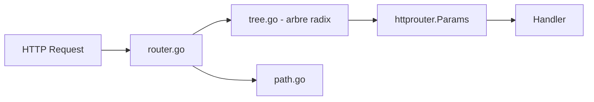

# julienschmidt/httprouter

> Routeur HTTP Go léger, à arbre radix, pour développeurs d'API qui veulent des routes sans ambiguïté.

## Le problème
Le mux standard de `net/http` ne gère ni variables dans les chemins ni distinction de méthode, et ses règles de priorité prêtent à confusion.

## Ce que ça fait vraiment
Un routeur implémentant `http.Handler`, avec un arbre radix par méthode HTTP. Paramètres nommés (`:name`) et « catch-all » (`*filepath`), une requête ne correspond qu'à une route ou à aucune, redirections automatiques sur slash final, correction de casse, gestionnaire de panics, réponses OPTIONS et 405 automatiques. Le README annonce zéro allocation sur le chemin de matching (revendication de l'auteur).

## Comment c'est branché


## Essayer
```bash
go get github.com/julienschmidt/httprouter
```
```go
router := httprouter.New()
router.GET("/", Index)
router.GET("/hello/:name", Hello)
log.Fatal(http.ListenAndServe(":8080", router))
```

## Coût et pièges
Gratuit. On ne peut pas enregistrer `/user/new` et `/user/:user` pour la même méthode. Dernier push en juillet 2024 ; 84 issues ouvertes.

## Ce que ce n'est pas
Ce n'est pas un framework : pas de middleware intégré (on chaîne des `http.Handler`). Les paramètres passent par un troisième argument, sauf via l'API `http.Handler` où ils sont dans le contexte.

## Alternatives
Gin : API façon martini, bâtie sur httprouter, plus complète. Le README cite aussi d'autres frameworks construits dessus (api2go, Jett, siesta…).

## Pour toi
À surveiller : sain pour de petites API Go, mais sans activité récente et un seul mainteneur ; en profil data/IA, il ne sert que si tu exposes un service Go.

