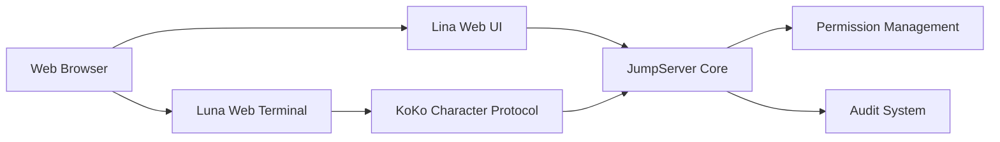

# jumpserver/jumpserver

> Bastion open source de gestion des accès à privilèges (PAM) pour équipes DevOps et IT.

## Le problème
Donner accès SSH, RDP, bases ou Kubernetes à des équipes sans traçabilité ni contrôle centralisé est risqué.

## Ce que ça fait vraiment
Cœur Django (comptes, actifs, permissions, audit, terminal) avec interface web Lina et terminal web Luna.
Connecteurs de protocoles : KoKo (SSH, etc.), Chen (bases en web), Kael (IA).
Enregistrement des sessions et audit ; composants Enterprise pour RDP, VNC, bases, applis distantes.

## Comment c'est branché


## Essayer
```bash
curl -sSL https://github.com/jumpserver/jumpserver/releases/latest/download/quick_start.sh | bash
```

## Coût et pièges
Serveur Linux 4 cœurs / 8 Go minimum. Identifiants par défaut `admin` / `ChangeMe` à changer. Plusieurs proxys protocolaires réservés à l'Enterprise.

## Ce que ce n'est pas
Pas un outil data/IA. Pas complet en édition communautaire pour RDP/VNC/bases avancés.

## Alternatives
Aucune alternative nommée dans le README.

## Pour toi
Hors périmètre, sauf si tu gères l'accès à l'infrastructure.
