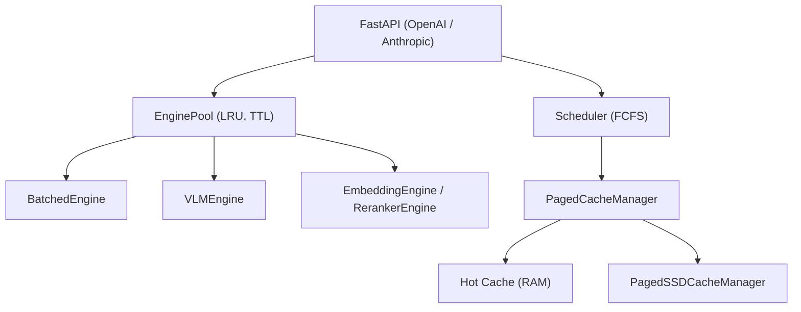

# jundot/omlx

> Serveur d'inférence local pour Apple Silicon, avec cache KV persistant et barre de menus macOS.

## Le problème
Les serveurs LLM locaux obligent à choisir entre confort et contrôle : on ne peut ni épingler les
modèles du quotidien en mémoire, ni faire permuter automatiquement les plus lourds, ni conserver le
cache de contexte quand la conversation change.

## Ce que ça fait vraiment
Un serveur compatible OpenAI et Anthropic (`/v1/chat/completions`, `/v1/messages`, `/v1/embeddings`,
`/v1/rerank`) qui découvre LLM, VLM, modèles OCR, embeddings et rerankers dans un dossier. Cache KV
à deux étages : palier chaud en RAM, palier froid sur SSD en safetensors, restauré après redémarrage.
Batching continu via `BatchGenerator` de mlx-lm, éviction LRU, épinglage de modèles, TTL par modèle,
plafond mémoire par processus. Tableau de bord `/admin` avec chat, bancs d'essai et téléchargeur
Hugging Face. Application de barre de menus en SwiftUI.

## Comment c'est branché


## Essayer
```bash
brew tap jundot/omlx https://github.com/jundot/omlx
brew install jundot/omlx/omlx
omlx start
omlx serve --model-dir ~/models --paged-ssd-cache-dir ~/.omlx/cache
python -c "from omlx.custom_kernels import native_kernel_status; print(native_kernel_status())"
```

## Coût et pièges
macOS 15.0+, Python 3.11–3.13, Apple Silicon obligatoire. Piège majeur : `pip install -e .` ne
construit pas les noyaux Metal, et les familles concernées basculent silencieusement sur un chemin
générique — 845 contre ~29 tok/s mesurés sur M3 Ultra pour GLM-5.2, avec plus de mémoire consommée.
Les construire exige Xcode complet. Le serveur refuse de démarrer sur une adresse non-loopback sans
clé d'API.

## Ce que ce n'est pas
Pas multiplateforme : Apple Silicon uniquement. L'inférence multi-Mac est explicitement expérimentale
et réservée aux constructions depuis les sources. Ce n'est pas un projet parti de zéro : il dérive de
`vllm-mlx` v0.1.0, ce que le README assume.

## Alternatives
- mlx-lm / mlx-vlm : les moteurs Apple sous-jacents, si un serveur n'est pas nécessaire.
- vllm-mlx : le projet d'origine dont oMLX est issu.

## Pour toi
Le meilleur candidat local sur Mac pour servir plusieurs modèles — à condition d'installer par le DMG.
