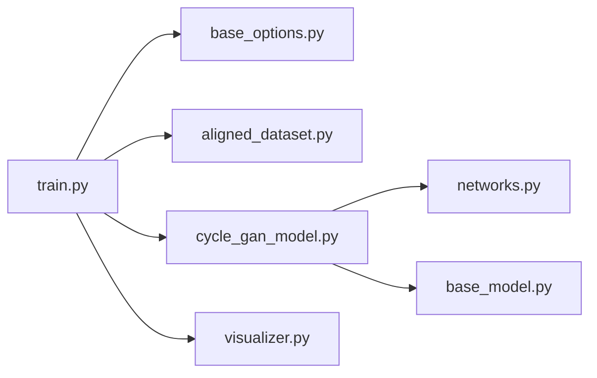

# junyanz/pytorch-CycleGAN-and-pix2pix

> Implémentation PyTorch de référence de CycleGAN et pix2pix pour la traduction image-à-image.

## Le problème
Reproduire des GAN de traduction d'images (appariée ou non) demande loaders, architectures et boucle d'entraînement cohérents.

## Ce que ça fait vraiment
`train.py` / `test.py` pilotés par options CLI : `--model cycle_gan|pix2pix|colorization|test`, `--dataset_mode`.
Loaders appariés, non appariés et single ; générateurs/discriminateurs dans `networks.py`.
Checkpoints dans `checkpoints/`, résultats en HTML, suivi W&B optionnel.
Mise à jour 2025 : Python 3.11, PyTorch 2.4, DDP multi-GPU via `torchrun`.

## Comment c'est branché


## Essayer
```bash
git clone https://github.com/junyanz/pytorch-CycleGAN-and-pix2pix
cd pytorch-CycleGAN-and-pix2pix
conda env create -f environment.yml
bash ./datasets/download_cyclegan_dataset.sh maps
python train.py --dataroot ./datasets/maps --name maps_cyclegan --model cycle_gan
```

## Coût et pièges
Gratuit ; GPU CUDA conseillé. `--norm batch` incompatible DDP. Dernier push août 2025.

## Ce que ce n'est pas
Pas l'état de l'art : les auteurs orientent vers img2img-turbo et CUT. Code de recherche, pas de service d'inférence.

## Alternatives
- img2img-turbo : traduction en une étape basée sur SD-Turbo, résultats supérieurs selon les auteurs.
- contrastive-unpaired-translation (CUT) : non apparié, plus rapide et économe.

## Pour toi
Ignorer pour un projet neuf : les auteurs eux-mêmes recommandent leurs successeurs ; utile seulement comme support pédagogique GAN.
