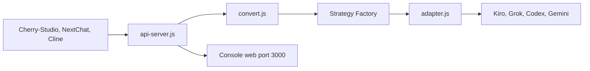

# justlovemaki/AIClient-2-API

> Proxy local qui expose des modèles réservés à des clients (Kiro, Grok, Codex) comme une API compatible OpenAI.

## Le problème
Des modèles ne sont accessibles que via leur client officiel, pas par API standard.

## Ce que ça fait vraiment
Serveur Node.js qui convertit entre protocoles OpenAI, Claude et Gemini, avec pool de comptes, rotation, bascule automatique, contrôle de santé, console web, journalisation complète des requêtes et sidecar TLS (Go uTLS) pour imiter un navigateur. Connexion par OAuth ou cookie SSO à des comptes gratuits ou personnels.

## Comment c'est branché


## Essayer
```bash
docker run -d -p 3000:3000 -p 8086:8086 -p 1455:1455 -p 56121:56121 -p 19876-19880:19876-19880 --restart=always -v "your_path/configs:/app/configs" --name aiclient2api justlikemaki/aiclient-2-api
```

## Coût et pièges
Les comptes tiers restent nécessaires ; mot de passe par défaut `admin123` à changer. Les ports OAuth doivent être libres. Le service est présenté comme contournant les limites de débit et de quota, et les blocages Cloudflare.

## Ce que ce n'est pas
Pas un service autorisé : il contourne les restrictions des fournisseurs, avec un risque de blocage de compte et de non-respect de leurs conditions. Le README parle d'usage d'étude et décline toute responsabilité.

## Alternatives
Aucune alternative nommée dans le README.

## Pour toi
À ignorer : contournement des conditions des fournisseurs, mainteneur unique, mot de passe par défaut, et pas de licence déclarée.
