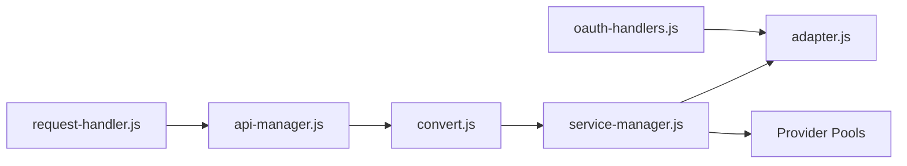

# justlovemaki/AIClient2API

> Proxy local qui expose en API compatible OpenAI des modèles réservés à des clients (Kiro, Codex, Grok, Antigravity).

## Le problème
Des outils comme Cline ou NextChat parlent l'API OpenAI, alors que certains modèles ne sont accessibles que via un client officiel.

## Ce que ça fait vraiment
Serveur Node qui convertit entre protocoles OpenAI, Claude et Gemini, route vers des adaptateurs par fournisseur, gère un pool de comptes avec bascule sur erreur, jetons OAuth, cooldown 429 et contournement de l'empreinte TLS via un sidecar Go. Console web, journaux complets des requêtes et réponses, plugins.

## Comment c'est branché


## Essayer
```bash
docker run -d -p 3000:3000 -p 8086:8086 -p 1455:1455 -p 56121:56121 -p 19876-19880:19876-19880 --restart=always -v "your_path/configs:/app/configs" --name aiclient2api justlikemaki/aiclient-2-api
cd docker && mkdir -p configs && docker compose up -d
```

## Coût et pièges
Mot de passe console par défaut `admin123` ; identifiants OAuth et cookies stockés localement ; journaux complets des requêtes. Le README vante le contournement des limites de débit et du blocage Cloudflare par imitation de navigateur, ce qui peut violer les conditions des fournisseurs et exposer tes comptes.

## Ce que ce n'est pas
Pas un fournisseur de modèles. Le « 99,9 % de disponibilité » est une affirmation du README, non vérifiée. Le README précise que l'usage est à vos risques.

## Alternatives
Aucune alternative nommée dans le README.

## Pour toi
À ignorer : il repose sur le contournement des restrictions des fournisseurs, avec risque de bannissement de compte et de fuite d'identifiants ; passe par une API officielle.

