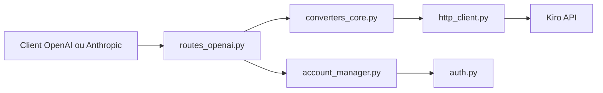

# jwadow/kiro-gateway

> Proxy FastAPI exposant les modèles de Kiro via des API compatibles OpenAI et Anthropic, pour outils de code.

## Le problème
Les modèles accessibles via un abonnement Kiro (Amazon Q Developer) ne se branchent pas directement sur Claude Code, Cursor ou le SDK OpenAI.

## Ce que ça fait vraiment
Traduit `/v1/chat/completions` et `/v1/messages` vers l'API Kiro. Gère streaming SSE, appels d'outils, vision, recherche web, relances sur 403/429/5xx, rafraîchissement des jetons, bascule entre plusieurs comptes et proxy VPN/SOCKS5. Les identifiants viennent de Kiro IDE, kiro-cli ou d'un jeton de rafraîchissement.

## Comment c'est branché


## Essayer
```bash
git clone https://github.com/Jwadow/kiro-gateway.git
cd kiro-gateway
pip install -r requirements.txt
cp .env.example .env
python main.py
```

## Coût et pièges
Il faut un compte Kiro ; les modèles dépendent de ton palier. Projet non affilié à AWS, Anthropic ou Kiro : risque vis-à-vis des conditions d'usage. 103 issues ouvertes.

## Ce que ce n'est pas
Pas un fournisseur de modèles : il ne fait que relayer ton abonnement. Dernier push en mai 2026.

## Alternatives
Aucune alternative nommée dans le README.

## Pour toi
À surveiller : pratique si tu as déjà Kiro, mais détournement d'un service tiers non officiel et AGPL ; je ne bâtirais pas de workflow pro dessus.

