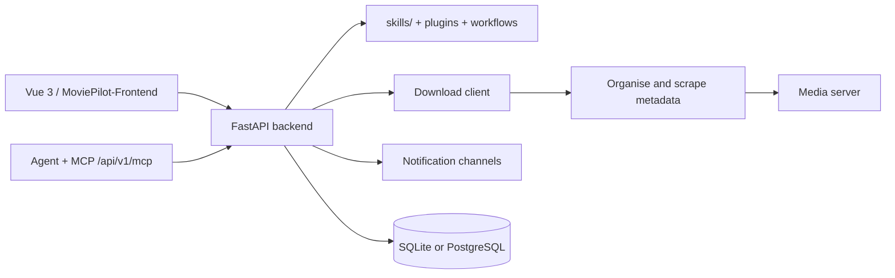

# jxxghp/MoviePilot

> **A self-hosted video library automation app**, for people managing subscriptions, downloads and file organisation.

## The problem

Without it, following a series means finding the source yourself, starting the download,
renaming files, fetching metadata and refreshing the media server — by hand, every episode.
The README presents the project as a redesign of part of the
[NAStool](https://github.com/NAStool/nas-tools) code, refocused on that automation core.

## What it actually does

The README lists a chain: subscribe, search, download, organise, scrape metadata, refresh the
media library and notify. It plugs into download clients, media servers, metadata sources and
messaging channels, and accepts plugins and workflows. It also ships an agent: once a model is
configured, search, subscription, download, organisation and troubleshooting can be driven in
natural language. The repository exposes a `skills/` directory other agents can import, and an
MCP endpoint `/api/v1/mcp` for MCP clients. The README names neither the supported downloaders,
nor the media servers, nor the models — all of that is deferred to the official wiki.

## How it is wired

No diagram is available for this repository; the graph below uses only the pieces named in the
README.



The README describes a split front and back: FastAPI on the back, Vue 3 on the front, the
latter living in a separate repository, `MoviePilot-Frontend`. PostgreSQL has its own setup
note, `docs/postgresql-setup.md`. The other files cited are `docs/v2-to-v3-overview.md`,
`docs/cli.md`, `docs/mcp-api.md`, `docs/rules/README.md`, `docs/development-setup.md`,
`docs/testing.md`, `docs/site-adapter-capture.md` and `skills/create-moviepilot-skill/SKILL.md`.

## Trying it

The README recommends Docker first but gives no `docker run` and no Compose file: it points to
the wiki. V3 uses the image `jxxghp/moviepilot-v3`; V2 and earlier keep their image names. The
only commands written in the README are these:

```shell
curl -fsSL https://raw.githubusercontent.com/jxxghp/MoviePilot/v3/scripts/bootstrap-local.sh | bash
```

```shell
npx skills add https://github.com/jxxghp/MoviePilot
```

After a local install, the `moviepilot` command handles initialisation, start, stop, update and
configuration viewing.

## Cost and gotchas

The README states the project charges nothing, offers no paid service and accepts no donations.
The real cost lies elsewhere: an always-on host, Docker, and third-party services for the chain
to be worth anything — a download client, a media server, a metadata source, a messaging
channel. The agent assumes "a configured model": which provider, at what token cost, is not
documented here. The local install script is a `curl | bash`, worth reading before running.
Finally the README's own disclaimer is explicit: study and exchange use only, no commercial use,
the author asks that it not be promoted on Chinese platforms, and responsibility falls on the
user.

## What it is not

It is not a content source: nothing is provided, the tool orchestrates services you bring
yourself, and the legality of what flows through remains the user's problem. It is not a player
or a media server either — it feeds and refreshes yours. And this repository is not the whole
application: front end, plugins, resources, server and the Rust part live in five separate
repositories, and most operational documentation (Compose, environment variables, directory
mappings) sits outside the repository, on the wiki.

## Alternatives

No comparable alternative in the catalogue: the suggested neighbours (kubernetes/kubernetes,
netdata/netdata, moby/moby, ansible/ansible) are infrastructure orchestration, monitoring and
automation, not media library management. The only neighbouring project the README names is
[NAStool](https://github.com/NAStool/nas-tools), whose code MoviePilot partly reuses while
narrowing the scope to automation.

## Why it matters to you

Little direct professional value for a data / AI / MLOps profile: this is a home application.
Two details are still worth a look — a FastAPI backend exposing an MCP endpoint, and a `skills/`
directory meant to be imported by other agents: a concrete example of how a conventional
application makes itself agent-drivable. Worth watching for the pattern, not adopting for the job.
