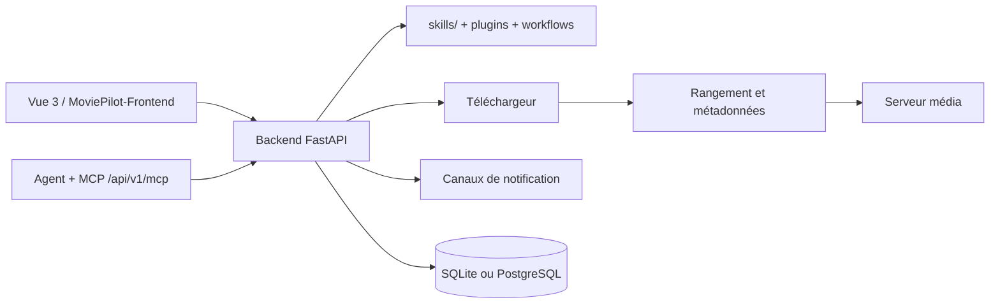

# jxxghp/MoviePilot

> **Une application d'automatisation de médiathèque vidéo**, auto-hébergée, pour qui gère abonnements, téléchargements et rangement de fichiers.

## Le problème

Sans elle, suivre une série veut dire chercher soi-même la source, lancer le téléchargement,
renommer les fichiers, récupérer les métadonnées puis rafraîchir le serveur média — à la main,
à chaque épisode. Le README se présente comme une refonte d'une partie du code de
[NAStool](https://github.com/NAStool/nas-tools), recentrée sur ce noyau d'automatisation.

## Ce que ça fait vraiment

Le README annonce un enchaînement : abonnement, recherche, téléchargement, rangement,
récupération des métadonnées (« 刮削 »), rafraîchissement de la médiathèque et notification.
Elle s'interface avec des clients de téléchargement, des serveurs média, des sources de
métadonnées et des canaux de messagerie, et accepte des plugins et des workflows.
Elle embarque aussi un agent : une fois un modèle configuré, on pilote recherche, abonnement,
téléchargement, rangement et diagnostic en langage naturel. Le dépôt expose un répertoire
`skills/` réutilisable par d'autres agents, et un point d'entrée MCP `/api/v1/mcp` pour les
clients MCP. Ni la liste des téléchargeurs, ni celle des serveurs média, ni celle des modèles
supportés ne figurent dans le README : c'est renvoyé au wiki officiel.

## Comment c'est branché

Aucun diagramme n'est disponible pour ce dépôt ; le schéma suivant reprend les pièces nommées
dans le README.



Le README décrit un front et un back séparés : back en FastAPI, front en Vue 3, ce dernier
vivant dans un dépôt distinct `MoviePilot-Frontend`. PostgreSQL fait l'objet d'une note
d'installation dédiée, `docs/postgresql-setup.md`. Les autres fichiers cités sont
`docs/v2-to-v3-overview.md`, `docs/cli.md`, `docs/mcp-api.md`, `docs/rules/README.md`,
`docs/development-setup.md`, `docs/testing.md`, `docs/site-adapter-capture.md` et
`skills/create-moviepilot-skill/SKILL.md`.

## Essayer

Le README recommande Docker en premier, mais ne donne aucun `docker run` ni Compose : il
renvoie au wiki. V3 utilise l'image `jxxghp/moviepilot-v3`, V2 et les versions antérieures
gardent leur nom d'image. Les seules commandes écrites dans le README sont celles-ci :

```shell
curl -fsSL https://raw.githubusercontent.com/jxxghp/MoviePilot/v3/scripts/bootstrap-local.sh | bash
```

```shell
npx skills add https://github.com/jxxghp/MoviePilot
```

Après l'installation locale, la commande `moviepilot` sert à l'initialisation, au démarrage,
à l'arrêt, à la mise à jour et à la consultation de la configuration.

## Coût et pièges

Le README dit que le projet n'est pas payant, ne propose aucun service payant et n'accepte
aucun don. Le coût réel est ailleurs : il faut un hôte qui tourne en permanence, Docker, et
des services tiers pour que la chaîne serve à quelque chose — téléchargeur, serveur média,
source de métadonnées, canal de messagerie. L'agent suppose « un modèle configuré » : quel
fournisseur, quel coût de jetons, non documenté ici. Le script d'installation locale est un
`curl | bash`, à lire avant de l'exécuter. Enfin l'avertissement du README est explicite :
usage d'apprentissage et d'échange uniquement, pas d'usage commercial, l'auteur demande de ne
pas en faire la promotion sur les plateformes chinoises, et la responsabilité revient à
l'utilisateur.

## Ce que ce n'est pas

Ce n'est pas une source de contenu : rien n'est fourni, l'outil orchestre des services que
l'on apporte soi-même, et la légalité de ce qui transite reste au compte de l'utilisateur.
Ce n'est pas non plus un lecteur ni un serveur média — il alimente et rafraîchit le vôtre.
Et le dépôt n'est pas l'application complète : front, plugins, ressources, serveur et partie
Rust vivent dans cinq dépôts séparés, et l'essentiel de la documentation d'exploitation
(Compose, variables d'environnement, mappages de répertoires) est hors dépôt, sur le wiki.

## Alternatives

Aucune alternative comparable dans le catalogue : les voisins proposés (kubernetes/kubernetes,
netdata/netdata, moby/moby, ansible/ansible) relèvent de l'orchestration, de la supervision et
de l'automatisation d'infrastructure, pas de la gestion de médiathèque. Le seul projet voisin
nommé par le README est [NAStool](https://github.com/NAStool/nas-tools), dont MoviePilot
reprend une partie du code en la recentrant sur l'automatisation.

## Pour toi

Peu d'intérêt métier direct pour un profil data / IA / MLOps : c'est une application
domestique. Deux détails valent le coup d'œil malgré tout — un backend FastAPI qui expose un
endpoint MCP, et un répertoire `skills/` pensé pour être importé par d'autres agents : un
exemple concret de la façon dont une application classique se rend pilotable par un agent.
À surveiller pour le motif, pas à adopter pour le métier.
