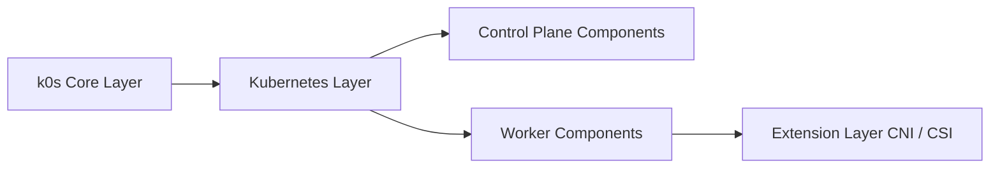

# k0sproject/k0s

> Distribution Kubernetes certifiée en binaire unique, pour cloud, bare metal et edge.

## Le problème
Installer et maintenir Kubernetes impose des dépendances hôte, des prérequis lourds et une gestion de cycle de vie pénible.

## Ce que ça fait vraiment
Binaire unique sans dépendance hôte hors noyau, Kubernetes 100 % amont.
Mono-nœud ou multi-nœuds HA, airgap, Docker ; etcd, SQLite, MySQL ou PostgreSQL comme datastore.
CNI (Kube-Router, Calico), CRI (containerd), CSI ; Konnectivity, CoreDNS, Metrics Server inclus.
Cycle de vie (mise à jour, sauvegarde) via k0sctl ; 1 vCPU, 1 Go RAM minimum.

## Comment c'est branché


## Essayer
```bash
make
make EMBEDDED_BINS_BUILDMODE=none
make check-basic
```

## Coût et pièges
Gratuit ; compilation via Docker. Licence non identifiée par GitHub (le README mentionne CC-BY-SA pour lui-même).
Peu d'add-ons fournis : ingress, mesh, stockage à ajouter soi-même.

## Ce que ce n'est pas
Pas une plateforme MLOps : juste le socle Kubernetes.
Pas « tout inclus » : périmètre volontairement minimal.

## Alternatives
Aucune alternative nommée dans le README.

## Pour toi
À surveiller : bon candidat pour un cluster léger (edge, labo, CI) hébergeant tes services ML, à vérifier côté licence.
