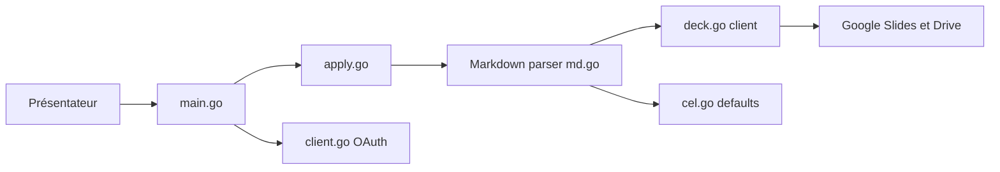

# k1LoW/deck

> CLI Go qui génère et met à jour des présentations Google Slides depuis un fichier Markdown.

## Le problème
Construire des slides dans un éditeur graphique mélange contenu et mise en forme et se prête mal au versionnage.

## Ce que ça fait vraiment
Le Markdown porte le contenu, un modèle Google Slides porte le design. `deck new` crée la présentation, `deck apply` (avec `--watch`) pousse les changements via les API Slides et Drive, `deck export` produit un PDF. Il gère les mises en page par CEL, les notes, les tableaux, et peut convertir des blocs de code en images.

## Comment c'est branché


## Essayer
```bash
brew install deck
deck doctor
deck new deck.md --title "Talk about deck"
deck apply --watch deck.md
deck open deck.md
```

## Coût et pièges
Projet Google Cloud avec OAuth (API Slides et Drive) à créer. Les images sont téléversées temporairement sur Drive en accès public ; des politiques d'organisation peuvent bloquer.

## Ce que ce n'est pas
Pas un générateur de design : les mises en page viennent de ton modèle Slides.

## Alternatives
googleworkspace/md2googleslides, cité dans le README.

## Pour toi
À surveiller : pratique pour produire des decks de revue de modèle depuis du Markdown (y compris par un agent IA), si tu es sous Google Workspace.

