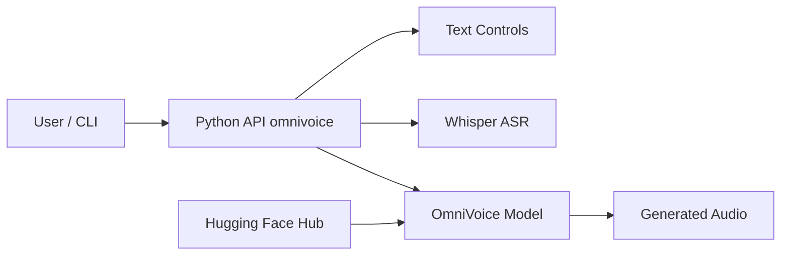

# k2-fsa/OmniVoice

> Modèle de synthèse vocale multilingue zéro-shot, 600+ langues, avec clonage et conception de voix.

## Le problème
Les modèles TTS couvrent peu de langues et exigent souvent un ajustement par locuteur.

## Ce que ça fait vraiment
Trois modes : clonage depuis 3 à 10 secondes d'audio de référence (Whisper transcrit si besoin), conception par attributs (genre, âge, hauteur, accent) et voix automatique. Balises non verbales comme `[laughter]` et correction de prononciation. RTF jusqu'à 0,025 ; FlashInfer accélère de 2 à 2,9 fois. Entraînement et évaluation (WER, MOS, similarité) inclus.

## Comment c'est branché


## Essayer
```bash
pip install omnivoice
omnivoice-demo --ip 0.0.0.0 --port 8001
omnivoice-infer --model k2-fsa/OmniVoice --text "This is a test for text to speech." --output hello.wav
```

## Coût et pièges
GPU NVIDIA, Apple Silicon (mps) ou Intel Arc ; PyTorch à installer avant. Le clonage interlingue garde l'accent de la référence. Le design de voix n'est entraîné que sur chinois et anglais.

## Ce que ce n'est pas
Le README interdit le clonage vocal non autorisé, l'usurpation et la fraude. Le mode le plus stable est le clonage, pas la conception de voix.

## Alternatives
Aucune alternative citée dans le README.

## Pour toi
À adopter : TTS multilingue sous Apache-2.0, installable en pip, avec CLI, batch multi-GPU et pipeline d'entraînement.

