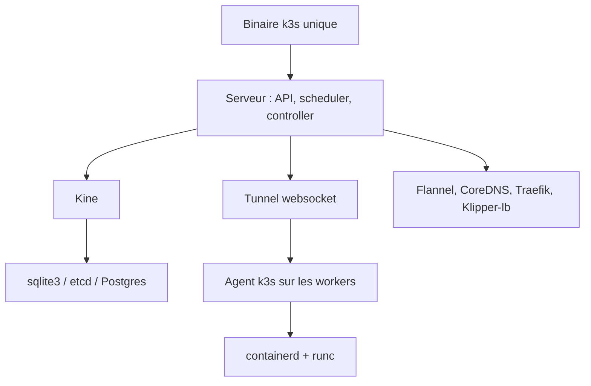

# k3s-io/k3s

> Distribution Kubernetes conforme, en un binaire de moins de 100 Mo, pour edge, IoT et CI.

## Le problème
Un Kubernetes complet demande etcd, plusieurs composants, une empreinte mémoire et un opérateur qui sait tout ça.
Sur un edge, une machine de CI ou un poste de dev, le rapport coût/bénéfice ne tient pas.

## Ce que ça fait vraiment
Distribution Kubernetes entièrement conforme, packagée en un binaire unique, avec sqlite3 comme backend de stockage par défaut (etcd3, MariaDB, MySQL et Postgres restent possibles).
Empreinte mémoire réduite en faisant tourner de nombreux composants dans un seul processus ; suppression des pilotes de stockage et des cloud providers in-tree, remplaçables par CSI et CCM.
Embarque containerd et runc, Flannel, CoreDNS, Metrics Server, Traefik, Klipper-lb, kube-router netpol, helm-controller, Kine, local-path-provisioner — tous désactivables ou remplaçables.
Gère les certificats TLS des composants, la liaison worker/serveur via un tunnel websocket, le déploiement automatique de manifestes locaux et un etcd embarqué.

## Comment c'est branché


## Essayer
```bash
curl -sfL https://get.k3s.io | sh -
sudo kubectl get nodes
curl -sfL https://get.k3s.io | K3S_URL=https://myserver:6443 K3S_TOKEN=XXX sh -
```

## Coût et pièges
Gratuit, sans dépendance OS lourde (noyau correct et montages cgroup suffisent).
L'installation par `curl | sh` écrit un service systemd/openrc et pose `kubectl`, `crictl`, `k3s-killall.sh`, `k3s-uninstall.sh` : à lire avant d'exécuter.

## Ce que ce n'est pas
Ce n'est pas un fork de Kubernetes : le README insiste, c'est une distribution, avec moins de 1 000 lignes de patchs et une volonté de rester proche de l'amont.
Ce n'est pas un Kubernetes allégé fonctionnellement : seuls les pilotes de stockage et cloud providers in-tree ont été retirés.
Ce n'est pas exempt de choix imposés : ingress, CNI, network policy et service load balancer sont des décisions d'opinion, à défaire si elles ne conviennent pas.

## Alternatives
Aucune distribution concurrente n'est nommée dans le README.

## Pour toi
Le bon Kubernetes pour un labo, une CI ou un déploiement edge de modèles : conforme, sans la taxe opérationnelle.
