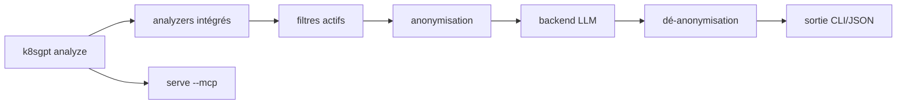

# k8sgpt-ai/k8sgpt

> Scanne un cluster Kubernetes, diagnostique les problèmes et les explique en langage courant.

## Le problème
Lire `kubectl describe` sur vingt ressources pour comprendre pourquoi un pod ne démarre pas demande une expérience SRE que tout le monde n'a pas.

## Ce que ça fait vraiment
Analyseurs intégrés (pod, service, ingress, deployment, job, node, webhooks, HPA, PDB, NetworkPolicy, Gateway API, sécurité, logs, stockage…) qui trient et extraient l'information pertinente.
`--explain` enrichit le diagnostic avec un LLM ; `--with-doc` y ajoute la documentation officielle Kubernetes.
Anonymisation : noms et labels sont masqués avant envoi au backend et restaurés dans la réponse.
Serveur MCP (`k8sgpt serve --mcp`) exposant 12 outils, 3 ressources et 3 prompts pour Claude Desktop et autres clients.

## Comment c'est branché


## Essayer
```sh
brew install k8sgpt
k8sgpt generate
k8sgpt auth add
k8sgpt analyze --explain --with-doc
k8sgpt serve --mcp --mcp-http --mcp-port 8089
```

## Coût et pièges
Le backend par défaut est OpenAI : clé à ta charge. La configuration, **clé comprise**, est stockée en clair dans `k8sgpt.yaml`. L'anonymisation ne couvre pas les events, ni les champs Describe, ObjectStatus et messages d'événement — un nom de projet peut fuiter par là.

## Ce que ce n'est pas
Pas un outil de remédiation : il diagnostique et suggère. Pas sûr par défaut en production sensible : l'équipe recommande elle-même un modèle local dans les environnements critiques. Le serveur MCP n'a pas de protection réseau propre.

## Alternatives
`k8sgpt-operator` pour la surveillance continue dans le cluster, et LiteLLM pour router vers 100+ fournisseurs — deux compléments cités, pas des concurrents.

## Pour toi
Très utile au quotidien, à condition de le brancher sur un modèle local ou LiteLLM plutôt que sur OpenAI.
