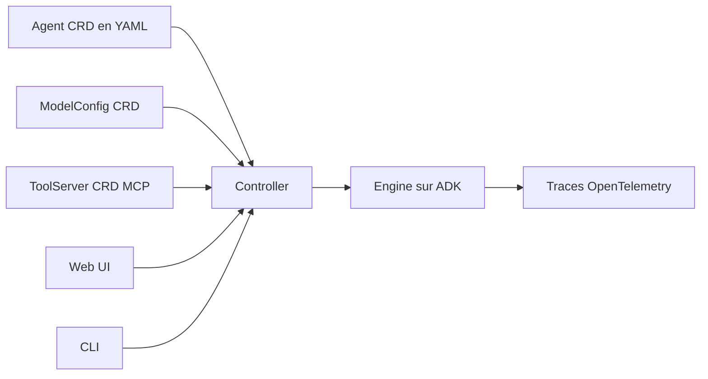

# kagent-dev/kagent

> Cadriciel natif Kubernetes pour construire, déployer et gérer des agents IA.

## Le problème
Un agent IA de production a besoin d'un endroit où tourner, se configurer et s'observer.
Kubernetes sait le faire pour des charges, pas pour des agents décrits en prompts et en outils.

## Ce que ça fait vraiment
Un agent est une ressource Kubernetes : un prompt système, un ensemble d'outils et d'agents, une config de LLM.
Les fournisseurs (OpenAI, Azure, Anthropic, Vertex AI, Ollama, passerelles) passent par la ressource `ModelConfig`.
Les outils MCP sont des `ToolServers`, réutilisables par plusieurs agents ; un serveur MCP intégré couvre
Kubernetes, Istio, Helm, Argo, Prometheus, Grafana et Cilium. Le traçage OpenTelemetry est pris en charge.

## Comment c'est branché

## Essayer
Aucune commande documentée dans le README : il renvoie au Quick Start et au guide d'installation.

## Coût et pièges
Il faut un cluster Kubernetes et une clé de fournisseur LLM, à ta charge.
Le README ne dit rien des garde-fous d'exécution des outils : un agent y parle à Helm et à Argo.

## Ce que ce n'est pas
Pas un modèle ni une bibliothèque d'agents : c'est l'enveloppe d'exécution et de configuration.
Pas utilisable hors Kubernetes.
Le README reste au niveau des principes ; la matière concrète est ailleurs.

## Alternatives
Aucune alternative nommée dans le README.

## Pour toi
À suivre si tes agents doivent vivre dans le cluster plutôt que sur ton poste ; sinon trop d'infrastructure.
