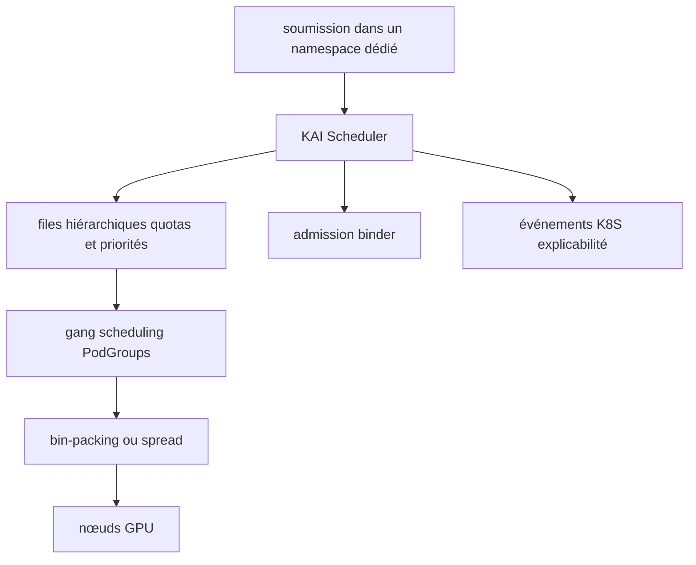

# kai-scheduler/KAI-Scheduler

> Ordonnanceur Kubernetes qui répartit des GPU entre files hiérarchiques pour des charges IA.

## Le problème
L'ordonnanceur Kubernetes par défaut ne sait ni garantir qu'un groupe de pods démarre ensemble, ni arbitrer équitablement des GPU entre équipes.
Sur un cluster partagé, un gros entraînement et un notebook interactif se disputent les mêmes cartes sans politique commune.

## Ce que ça fait vraiment
Fait du gang scheduling : tous les pods d'un groupe démarrent, ou aucun. Gère les PodGroups hiérarchiques pour les charges distribuées et désagrégées.
Applique quotas, limites, poids de sur-quota et priorités par file, avec équité DRF, partage temporel tenant compte de l'historique, et une durée minimale garantie avant préemption.
Sépare priorité et préemptibilité en deux politiques indépendantes ; consolide les charges en cours pour réduire la fragmentation.
Partage un ou plusieurs GPU entre charges, gère DRA (ResourceClaims NVIDIA/AMD, GB200/GB300) et l'ordonnancement conscient de la topologie.

## Comment c'est branché


## Essayer
```sh
helm upgrade -i kai-scheduler oci://ghcr.io/kai-scheduler/kai-scheduler/kai-scheduler -n kai-scheduler --create-namespace --version <VERSION>
```

## Coût et pièges
Cluster Kubernetes, Helm et NVIDIA GPU-Operator requis pour les charges GPU.
Sur OpenShift avec un gpu-operator antérieur à v25.10.0, ajouter `--set-string admission.gpuFractionRuntimeClassName=""` — surtout pas `null`.
Ne jamais soumettre de charge dans le namespace `kai-scheduler` lui-même.

## Ce que ce n'est pas
Pas un remplaçant obligatoire : il cohabite avec d'autres ordonnanceurs installés sur le cluster.
Pas un produit neuf de bout en bout : il est construit à partir de kube-batch.
Pas une solution mono-machine : sans cluster ni GPU-Operator, il n'y a rien à ordonnancer.

## Alternatives
- kube-batch : la base dont KAI dérive, plus simple si seul le gang scheduling est nécessaire.

## Pour toi
Pertinent le jour où tu partages un cluster GPU entre plusieurs équipes ; inutile sur une seule machine.
