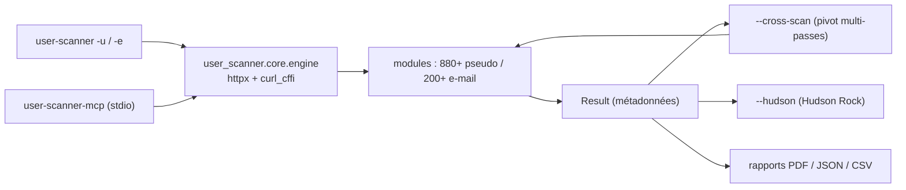

# kaifcodec/user-scanner

> Suite OSINT en ligne de commande pour vérifier la présence d'un e-mail ou d'un pseudo.

## Le problème
Vérifier sur quelles plateformes un pseudonyme ou une adresse est enregistré se fait sinon
plateforme par plateforme, à la main, sans trace exploitable.

## Ce que ça fait vraiment
Interroge plus de 1 080 vecteurs — 200+ sites pour l'e-mail, 880+ plateformes pour le pseudo — et
récupère les métadonnées publiques exposées (avatars, bios, nombre d'abonnés, UID, statuts). Le
moteur de pivot `--cross-scan` extrait des premiers résultats les handles, liens de profil et
adresses exposées, puis relance des passes sur ces nouveaux vecteurs, avec profondeur réglable
(`--cross-depth`). `--hudson` interroge les logs de compromission par infostealer de Hudson Rock.
Parallélisme via `httpx` et `curl_cffi` avec usurpation d'empreinte TLS, rotation de proxies à
détection de protocole et validation préalable, générateur de permutations de pseudos, exports PDF
(avec photos), JSON et CSV, et un serveur MCP en stdio exposant `scan_username`, `scan_email` et
`list_available_modules`.

## Comment c'est branché


## Essayer
```bash
python3 -m pip install --upgrade pip
pip install user-scanner
user-scanner -u johndoe
user-scanner -e johndoe@gmail.com --cross-scan --cross-links verified
user-scanner -u johndoe --hudson
user-scanner -u johndoe -c dev
user-scanner -lu
user-scanner -uf usernames.txt
user-scanner -u johndoe -f pdf -o report.pdf
user-scanner -u johndoe -P proxies.txt --validate-proxies
user-scanner-mcp
nix run github:kaifcodec/user-scanner/main -- --help
```

## Coût et pièges
Gratuit, aucune clé. Les coûts réels sont juridiques et opérationnels : le README documente un
modèle de coût pour le cross-scan, et l'usurpation d'empreinte TLS plus la rotation de proxies
servent à contourner les protections des plateformes visées.

## Ce que ce n'est pas
Pas un outil à lancer sur une personne au hasard : le dépôt le cadre explicitement à un usage
éducatif, à la recherche de sécurité **autorisée** et à l'OSINT défensif, et décline toute
responsabilité. L'absence de résultat ne prouve rien, et un résultat positif n'identifie personne.

## Alternatives
Aucune alternative nommée dans le README ; Hudson Rock y est une source de données, pas un substitut.

## Pour toi
Hors périmètre, et à ne sortir que dans un cadre d'engagement écrit : à ignorer ici.
