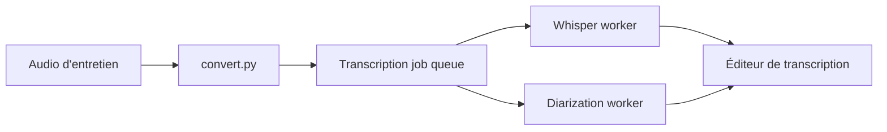

# kaixxx/noScribe

> Application de bureau locale qui transcrit des entretiens avec identification des locuteurs, pour chercheurs et journalistes.

## Le problème
Transcrire des entretiens confidentiels sans les envoyer dans le cloud ni payer un service.

## Ce que ça fait vraiment
Convertit l'audio, lance Whisper (faster-whisper) pour le texte et pyannote pour la diarisation en processus séparés, puis propose un éditeur pour relire et corriger. Environ 60 langues, Windows, macOS et Linux. Installation et usage décrits sur noscribe.de.

## Comment c'est branché

## Essayer
Aucune commande documentée dans le README ; téléchargement et usage sur https://noscribe.de.

## Coût et pièges
Gratuit, tout en local. Les modèles tournent sur la machine : un GPU aide. Méfie-toi de noscribe.ai, domaine sans lien avec le projet.

## Ce que ce n'est pas
Pas un service cloud ni une transcription parfaite : la relecture reste nécessaire. Orienté entretiens, pas montage vidéo.

## Alternatives
Aucune alternative nommée dans le README.

## Pour toi
À adopter pour de la transcription locale fiable avec locuteurs : confidentialité, projet actif (push 2026-09), GPL sans conséquence en usage d'utilisateur.

