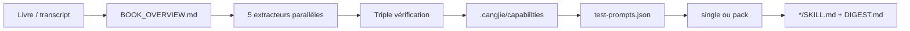

# kangarooking/cangjie-skill

> Méthodologie et gabarits pour distiller livres, vidéos et podcasts en skills d'agent.

## Le problème
Livres lus, vidéos gardées, podcasts écoutés : la connaissance reste au stade de la note et
n'est jamais rappelée au moment d'une décision réelle.

## Ce que ça fait vraiment
Applique un pipeline en sept étapes, **RIA-TV++** : compréhension globale à la méthode Adler
(`BOOK_OVERVIEW.md`), cinq extracteurs parallèles (cadres, principes, cas, contre-exemples, glossaire),
triple vérification avec porte de promotion, construction de cartes de capacité R/I/A1/A2/E/B dans
`.cangjie/capabilities/`, liaison façon Zettelkasten, tests de résistance avec questions pièges,
puis compilation déterministe en `single` (un skill routeur) ou `pack` (routeur + skills autonomes).
Un outil local unique, `scripts/cangjie.py`, couvre diagnostic, compilation, mise à jour, réparation, rollback.

## Comment c'est branché


## Essayer
```bash
mkdir -p ~/.dsh/packages
curl -fL "https://github.com/kangarooking/cangjie-skill/releases/download/v2.5.0/dsh-cangjie-skill-2.5.0.tgz" \
  -o ~/.dsh/packages/dsh-cangjie-skill-2.5.0.tgz
(cd ~/.dsh/packages && shasum -a 256 -c dsh-cangjie-skill-2.5.0.tgz.sha256)
dsh plugin --profile web add ~/.dsh/packages/dsh-cangjie-skill-2.5.0.tgz
```

## Coût et pièges
Gratuit, licence MIT annoncée dans l'arborescence. Le coût réel est celui des appels au modèle pendant
l'extraction, non chiffré. Piège signalé par le projet : les archives automatiques de GitHub ne contiennent
pas le rafraîchissement du 13 septembre 2026 — télécharger le paquet republié et vérifier `BUILD_INFO.json`.

## Ce que ce n'est pas
Pas un résumeur : le but affiché est la réutilisation structurée, pas la compression narrative.
Pas un téléchargeur de vidéos — il faut passer par un skill compagnon pour obtenir le transcript.
Projet porté par une seule personne, avec une forte composante d'autopromotion.

## Alternatives
- **nuwa-skill** : distille des personnes (style, façon de penser) plutôt que des contenus.
- **darwin-skill** : fait évoluer des skills existants au lieu d'en créer.

## Pour toi
La méthode vaut plus que l'outil : à lire pour structurer tes propres skills, sans forcément l'installer.
