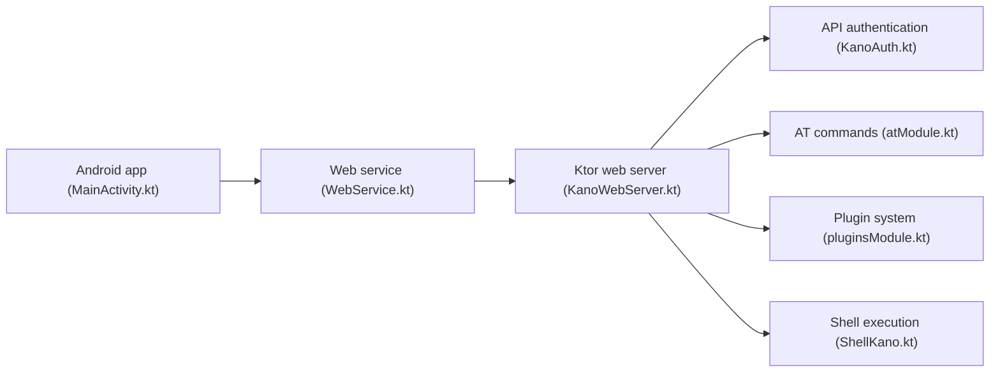

# kanoqwq/UFI-TOOLS

> Outil de gestion et d'extension pour routeurs de poche 4G/5G ZTE à base Android.

## Le problème
Administrer ces boîtiers (signal, bandes, SMS, système) sans interface native riche.

## Ce que ça fait vraiment
- Verrouillage de bande ou de cellule sans redémarrage, bascule 3G/4G/5G, mesures de signal.
- SMS (envoi, réception, transfert automatique), terminal de commandes AT, SSH.
- Boutique de plugins (AdGuardHome, EasyTier, crontab…).
- Console web sur `http://IP:2333`, application Android (Ktor) ; version « PE » à installer sur un téléphone.

## Comment c'est branché

## Essayer
Aucune commande documentée : installation par vidéos (Bilibili), installation guidée ou module Magisk.

## Coût et pièges
Les « fonctions avancées » donnent un accès root ; le README conseille de sauvegarder ses données. Documentation en chinois.

## Ce que ce n'est pas
Pas un outil généraliste : limité à certains modèles ZTE/Unisoc testés.

## Alternatives
Aucune alternative nommée dans le README.

## Pour toi
À ignorer : matériel réseau de niche, sans rapport avec data/IA/MLOps.

