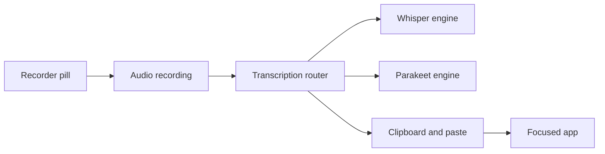

# karansinghgit/speaktype

> Application de dictée vocale locale pour macOS, Windows et Linux, qui écrit dans n'importe quelle application.

## Le problème
Les outils de dictée envoient la voix à des serveurs et coûtent un abonnement.

## Ce que ça fait vraiment
On maintient un raccourci, on parle, la transcription est collée là où se trouve le curseur. Modèles Whisper (99 langues) et Parakeet (anglais + 24 langues européennes), téléchargés une fois (75 Mo à 1,6 Go). Dictionnaire de corrections, suppression des mots de remplissage, historique local.

## Comment c'est branché


## Essayer
```bash
sudo apt install ./SpeakType_*.deb
chmod +x SpeakType_*.AppImage
```

## Coût et pièges
Gratuit, sans compte. Applications non signées : validations manuelles sur Mac et Windows. Permissions micro et accessibilité demandées. Windows et Linux décrits comme très jeunes.

## Ce que ce n'est pas
Pas un service cloud ni un nettoyage de texte par IA (annoncé « à venir »). Les moteurs sont ceux de whisper.cpp, ONNX Runtime, WhisperKit et FluidAudio.

## Alternatives
Aucune alternative nommée dans le README.

## Pour toi
À surveiller : exemple concret de reconnaissance vocale locale (Whisper/Parakeet) utile à tester, mais le projet est jeune.

