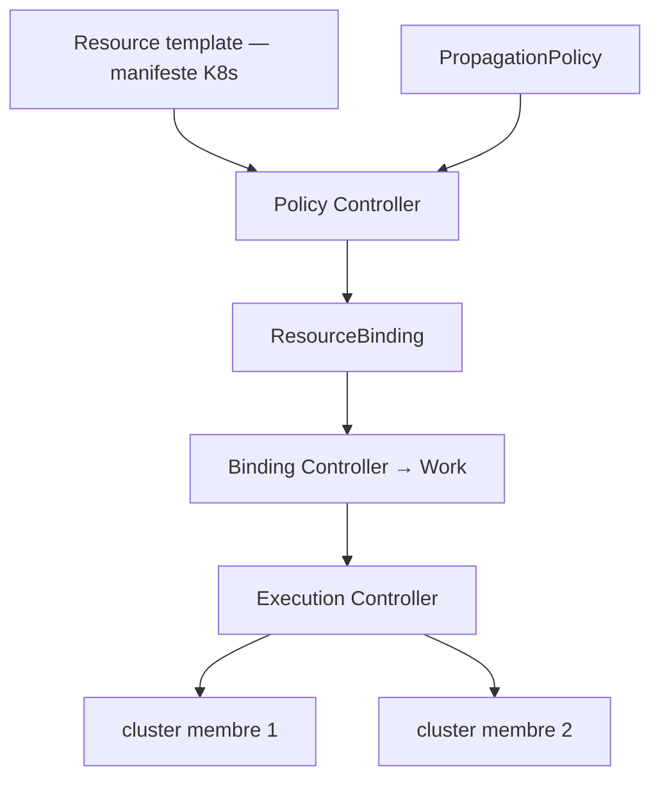

# karmada-io/karmada

> Orchestrateur multi-cluster Kubernetes qui propage des applications sans les modifier.

## Le problème
Déployer la même application sur plusieurs clusters et plusieurs clouds impose de dupliquer les manifestes et de gérer à la main la bascule en cas de panne.
Chaque fournisseur pousse sa propre solution, donc son verrouillage.

## Ce que ça fait vraiment
Il parle les API Kubernetes natives : un template de ressource est un manifeste standard, et une `PropagationPolicy` séparée décrit où et comment il se répand.
Une `OverridePolicy` spécialise la configuration par cluster — préfixe d'image selon la région, StorageClass selon le fournisseur.
Quatre contrôleurs font le travail : Cluster (rattachement), Policy (sélection des ressources), Binding (création des Work), Execution (distribution vers les clusters membres).
Les politiques d'ordonnancement couvrent l'affinité de cluster, le découpage et le rééquilibrage multi-cluster, et la HA par région, AZ, cluster ou fournisseur.

## Comment c'est branché


## Essayer
```bash
git clone https://github.com/karmada-io/karmada
cd karmada
hack/local-up-karmada.sh
export KUBECONFIG="$HOME/.kube/karmada.config"
kubectl create -f samples/nginx/deployment.yaml
kubectl create -f samples/nginx/propagationpolicy.yaml
kubectl get deployment
```

## Coût et pièges
Gratuit, projet CNCF diplômé. Il faut kubectl v1.19+, kind v0.14+ et une version de Go conforme au `go.mod` pour l'installation locale.
Deux contextes cohabitent : `karmada-apiserver` est celui à utiliser, `karmada-host` ne sert qu'au débogage de l'installation — confusion fréquente.

## Ce que ce n'est pas
Ce n'est pas une surcouche propriétaire : rien à changer dans les applications, et la compatibilité est testée sur dix versions de Kubernetes.
Ce n'est pas un projet neuf non plus — il continue Kubernetes Federation v1 et v2, dont il hérite des concepts.

## Alternatives
Aucune alternative n'est nommée dans le README.

## Pour toi
Pertinent seulement si tes charges d'inférence s'étalent sur plusieurs clusters ; sinon c'est une couche de trop.
