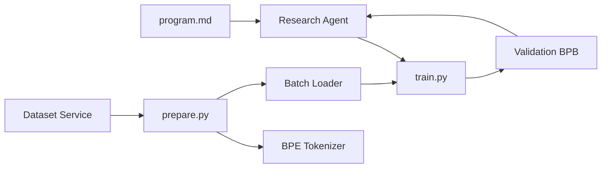

# karpathy/autoresearch

> Boucle où un agent IA modifie un petit entraînement GPT, le lance cinq minutes, garde ou jette.

## Le problème
Explorer des variantes d'architecture ou d'hyperparamètres à la main coûte des soirées ; on voudrait qu'un agent le fasse la nuit.

## Ce que ça fait vraiment
Trois fichiers comptent. `prepare.py` télécharge les données, entraîne un tokenizer BPE, fournit dataloader et évaluation (non modifié). `train.py` contient le GPT, l'optimiseur Muon + AdamW et la boucle : c'est le seul fichier que l'agent édite. `program.md` donne les consignes à l'agent : c'est le fichier que l'humain fait évoluer.
Chaque essai tourne 5 minutes chrono ; la métrique est `val_bpb` (plus bas = mieux), indépendante de la taille du vocabulaire. Environ 12 essais par heure.

## Comment c'est branché


## Essayer
```bash
curl -LsSf https://astral.sh/uv/install.sh | sh
uv sync
uv run prepare.py
uv run train.py
```

## Coût et pièges
Un GPU NVIDIA (testé sur H100), Python 3.10+, uv, plus l'abonnement ou l'API de l'agent (Claude, Codex). Le README conseille de désactiver toutes les permissions de l'agent : risque réel sur ta machine.

## Ce que ce n'est pas
L'orchestration autonome et l'historique d'essais ne sont pas codés : c'est l'agent qui les porte. Les résultats ne se comparent pas d'une machine à l'autre, le budget étant en temps. Pas d'entraînement distribué.

## Alternatives
- miolini/autoresearch-macos — pour macOS.
- trevin-creator/autoresearch-mlx — pour macOS via MLX.
- andyluo7/autoresearch — pour GPU AMD.

## Pour toi
À surveiller comme gabarit de « recherche par agent » ; à lancer seulement sur une machine isolée.
