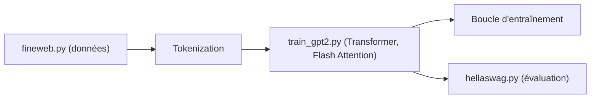

# karpathy/build-nanogpt

> Reproduction pas à pas de GPT-2 (124M) depuis un fichier vide, commit par commit, avec vidéo.

## Le problème
Comprendre l'entraînement d'un GPT de zéro sans se noyer dans un gros dépôt.

## Ce que ça fait vraiment
L'historique git est volontairement propre pour suivre la construction de `train_gpt2.py`, jusqu'à un GPT-2 124M. Le README donne environ 1 h et 10 $ de GPU cloud pour le reproduire, et dit que le code peut aussi reproduire des GPT-3. Le modèle ne fait que compléter du texte : pas de mise au point conversationnelle. Errata listés (buffer de biais, conversion uint16, `device_type`).

## Comment c'est branché


## Essayer
```bash
# Aucune commande documentée dans le README : suivre la vidéo et l'historique des commits.
```

## Coût et pièges
GPU cloud à ta charge (Lambda recommandé). Aucune licence déclarée ; dernier push en août 2024. Le rôle exact de chaque fichier n'est pas décrit dans le README.

## Ce que ce n'est pas
Pas un ChatGPT : on ne peut pas dialoguer avec le modèle. Pas un dépôt de production.

## Alternatives
litGPT et TinyLlama : cités pour des entraînements plus proches de la production.

## Pour toi
À adopter comme support d'apprentissage : la meilleure façon de relire le fonctionnement d'un GPT ; à ne pas réutiliser dans un produit sans licence claire.

