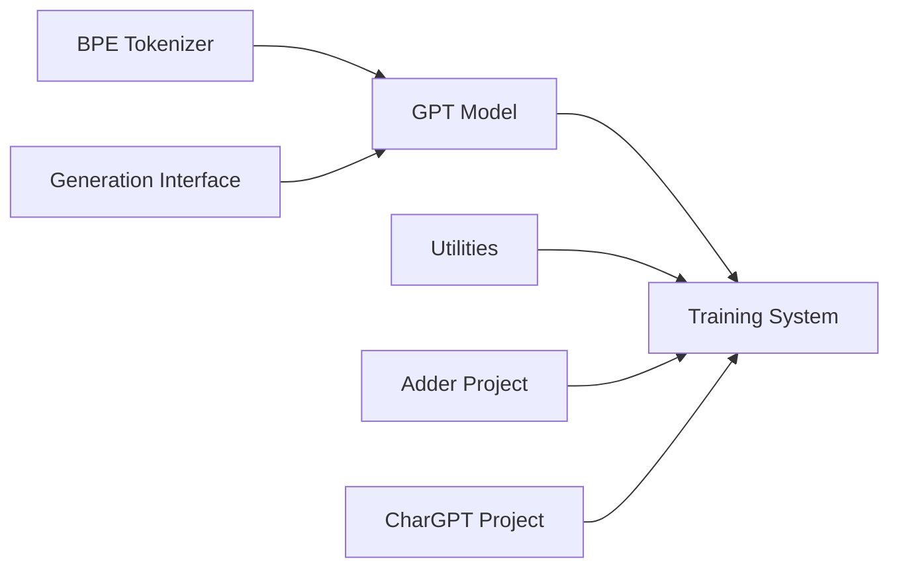

# karpathy/minGPT

> Réimplémentation PyTorch pédagogique de GPT (entraînement et inférence) en trois fichiers.

## Le problème
Les implémentations GPT industrielles sont trop touffues pour comprendre ce qui se passe réellement dans un transformer décodeur.

## Ce que ça fait vraiment
`mingpt/model.py` (~300 lignes) définit le Transformer, `bpe.py` l'encodeur BPE d'OpenAI, `trainer.py` la boucle d'entraînement.
Peut charger GPT-2 pré-entraîné (`generate.ipynb`).
Projets d'exemple : `adder` (addition), `chargpt` (modèle caractère), `demo.ipynb` (tri).
Notes de lecture détaillées des papiers GPT-1/2/3 et Image GPT.

## Comment c'est branché


## Essayer
```bash
git clone https://github.com/karpathy/minGPT.git
cd minGPT
pip install -e .
python -m unittest discover tests
```

## Coût et pièges
Gratuit ; pas de requirements.txt. Semi-archivé depuis 2023.

## Ce que ce n'est pas
Pas un outil de production : pas de précision mixte ni d'entraînement distribué.

## Alternatives
- nanoGPT : réécriture de l'auteur, simple mais capable de reproduire des benchmarks.
- huggingface/transformers : complet, mais plus difficile à tracer.

## Pour toi
Surveiller comme ressource d'apprentissage : parfait pour former une équipe au fonctionnement de GPT, mais nanoGPT est le choix pour expérimenter.
