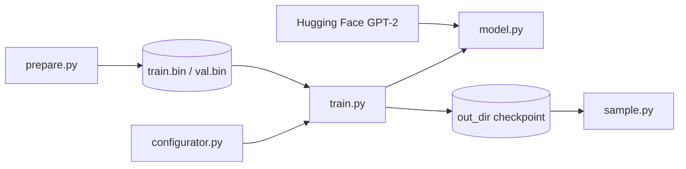

# karpathy/nanoGPT

> Code minimal pour entraîner ou fine-tuner des GPT de taille moyenne ; déclaré obsolète par son auteur.

## Le problème
Comprendre ou reproduire l'entraînement d'un GPT est difficile avec des frameworks lourds où la boucle se perd dans les abstractions.

## Ce que ça fait vraiment
`model.py` (~300 lignes) définit un GPT et peut charger les poids GPT-2 d'OpenAI ; `train.py` (~300 lignes) charge des flux de tokens binaires (`train.bin`, `val.bin`), entraîne, évalue et sauvegarde dans `out_dir` ; `sample.py` génère du texte depuis un checkpoint.
Des scripts `prepare.py` par jeu de données (Shakespeare caractère, OpenWebText) tokenisent en amont. `configurator.py` applique un fichier de config et les surcharges `--clé=valeur`. DDP via `torchrun`, `torch.compile`, CPU et MPS possibles. GPT-2 124M se reproduit en ~4 jours sur 8×A100.

## Comment c'est branché


## Essayer
```bash
pip install torch numpy transformers datasets tiktoken wandb tqdm
python data/shakespeare_char/prepare.py
python train.py config/train_shakespeare_char.py
python sample.py --out_dir=out-shakespeare-char
```

## Coût et pièges
Gratuit, MIT. Un GPU pour des essais utiles (3 min sur A100 pour Shakespeare) ; possible sur CPU en réduisant tout. Wandb est optionnel.

## Ce que ce n'est pas
Plus maintenu : l'auteur le dit « très vieux et déprécié » et renvoie vers nanochat. Ni serveur, ni pipeline de production : des scripts d'étude.

## Alternatives
- nanochat — son successeur, désigné par l'auteur lui-même.

## Pour toi
À ignorer au profit de nanochat ; seulement pour relire une boucle d'entraînement minimale.
