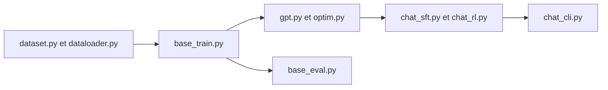

# karpathy/nanochat

> Banc d'essai minimal pour entraîner un petit LLM de bout en bout sur un nœud GPU.

## Le problème
Comprendre ou reproduire l'entraînement complet d'un modèle de langage (tokenisation, pré-entraînement, SFT, RL, inférence) est difficile avec des bases de code volumineuses.

## Ce que ça fait vraiment
Code Python/PyTorch court couvrant tout le cycle : tokenizer BPE, chargeur de données, pré-entraînement, évaluation (CORE, bits par octet), finetuning SFT, RL, interface de discussion en terminal. Un seul réglage, `--depth`, dérive les autres hyperparamètres. Le README chiffre un modèle de niveau GPT-2 à environ 48 dollars (8 H100, ~2 heures) et tient un classement « temps jusqu'à GPT-2 ».

## Comment c'est branché


## Essayer
```bash
uv sync --extra gpu
source .venv/bin/activate
bash runs/speedrun.sh
python -m scripts.chat_cli
```

## Coût et pièges
Location d'un nœud 8 H100 (~24 dollars/heure selon le README). Moins de 80 Go de VRAM : réduire `--device-batch-size`. Version CPU ou MPS : résultats faibles. Suivi via wandb.

## Ce que ce n'est pas
Ce n'est pas un modèle prêt à l'emploi ni un chatbot utile : le résultat ressemble à un « enfant de maternelle », dit le README. C'est un banc expérimental.

## Alternatives
Aucune alternative nommée dans le README (inspiré de modded-nanogpt).

## Pour toi
Adopter comme outil d'apprentissage : lire ce code apprend l'entraînement de bout en bout pour le prix d'un week-end de GPU.

