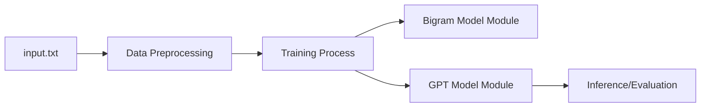

# karpathy/ng-video-lecture

> Code de la leçon nanoGPT de Karpathy : un bigramme puis un mini GPT, pour apprendre.

## Le problème
Comprendre comment se construit un modèle de langage de type GPT, ligne par ligne, sans framework lourd.

## Ce que ça fait vraiment
Deux scripts, `bigram.py` (modèle bigramme) et `gpt.py` (mini transformeur), s'entraînent sur `input.txt`. L'historique git suit la vidéo. L'auteur précise que l'initialisation des poids n'est pas traitée comme dans nanoGPT : la convergence est plus lente.

## Comment c'est branché

## Essayer
Aucune commande documentée dans le README (les scripts sont `bigram.py` et `gpt.py`).

## Coût et pièges
Un GPU accélère l'entraînement ; le README n'en parle pas. Aucune licence : réutilisation juridiquement floue.

## Ce que ce n'est pas
Ce n'est pas nanoGPT : les noms de modules diffèrent et le copier-coller n'est pas possible. Le correctif d'initialisation promis n'est pas publié.

## Alternatives
- nanoGPT (cité dans le README) : code à jour avec `_init_weights`.

## Pour toi
À surveiller : bon support pédagogique à suivre avec la vidéo, mais figé depuis janvier 2024 et sans licence.

