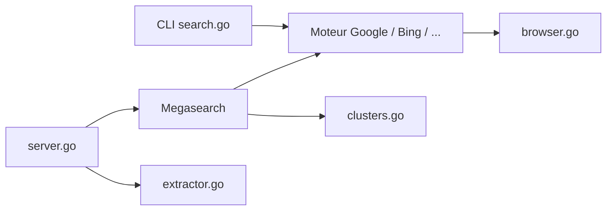

# karust/openserp

> API et CLI de résultats de recherche Google, Bing, Yandex et autres, auto-hébergée, pour agents et SEO.

## Le problème
Les API de recherche payantes facturent chaque requête et ne couvrent pas tous les moteurs ; les agents ont besoin de résultats structurés.

## Ce que ça fait vraiment
Interroge six moteurs (Google, Yandex, Baidu, Bing, DuckDuckGo, Ecosia) via navigateur ou HTTP brut et renvoie un même schéma JSON. Megasearch fusionne et dédoublonne plusieurs moteurs, l'extraction ajoute le contenu des pages en Markdown. Images, filtres, proxys, cache. Formats JSON, Markdown, texte, NdJSON ; SDK JS et Python, serveur MCP, nœud n8n.

## Comment c'est branché


## Essayer
```bash
docker run --rm -p 127.0.0.1:7000:7000 karust/openserp:latest serve -a 0.0.0.0 -p 7000
go install github.com/karust/openserp@latest
openserp search duckduckgo "open source serp api" --format markdown
curl "http://127.0.0.1:7000/google/search?text=golang&limit=10"
```

## Coût et pièges
Pas de clé d'API, mais il faut un navigateur ou des proxys ; les moteurs peuvent bloquer ou changer leur HTML. Une version cloud payante existe avec le même schéma.

## Ce que ce n'est pas
Pas une API officielle des moteurs : c'est du scraping, donc fragile et possiblement contraire aux conditions d'usage. Aucune garantie de disponibilité.

## Alternatives
- OpenSERP Cloud : même API hébergée.

## Pour toi
À surveiller : pratique pour donner de la recherche à un agent sans clé, mais la fragilité du scraping interdit d'en faire une dépendance critique.

