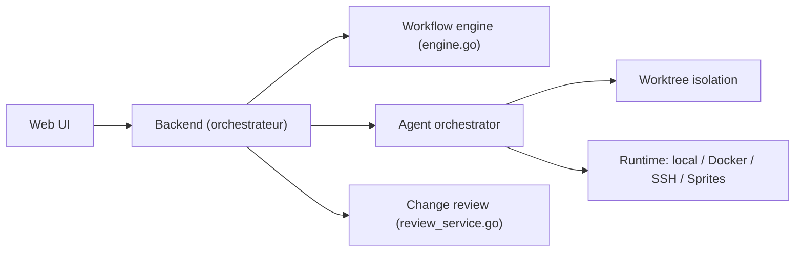

# kdlbs/kandev

> Plan de contrôle auto-hébergeable pour lancer des agents de code en parallèle et relire leurs changements.

## Le problème
Les TUI d'agents conviennent pour exécuter, mais relire et itérer sur plusieurs tâches parallèles n'y passe pas à l'échelle.

## Ce que ça fait vraiment
Tableau kanban et pipelines de tâches ; chaque tâche tourne dans un worktree git isolé, en processus local, conteneur Docker, SSH ou cloud. Plus de vingt agents au choix (Claude Code, Codex, Copilot, Gemini CLI…). Espace intégré avec éditeur, terminal et diff, intégrations GitHub, GitLab, Jira, Linear. Mode « Office » en cours de développement. Aucune télémétrie selon le README.

## Comment c'est branché


## Essayer
```bash
brew install kdlbs/kandev/kandev
kandev
npx kandev@latest
```

## Coût et pièges
Gratuit ; abonnements ou clés des agents à ta charge. Docker optionnel. 135 issues ouvertes. AGPL-3.0.

## Ce que ce n'est pas
Pas un agent lui-même : il en orchestre. Le mode Office n'est pas encore un fonctionnement documenté.

## Alternatives
Aucune alternative nommée dans le README.

## Pour toi
À surveiller : utile si tu lances plusieurs agents de code et veux une revue centralisée ; jeune et en évolution rapide.

