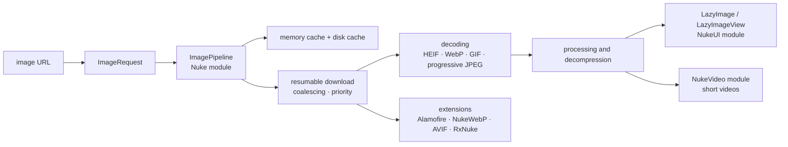

# kean/Nuke

> **Image loading, processing and caching for Apple platform apps, in Swift.**

## The problem

Showing a remote image in an iOS or macOS app means rewriting the same chain every time:
download, resume after a dropped connection, decode, resize, memory then disk cache, cancel
when the cell scrolls off screen, and deduplicate identical requests fired by several views.

## What it actually does

Nuke ships an `ImagePipeline` that goes from a URL to a displayed image. The README lists what
the chain covers: memory and disk cache, image processing and decompression, request coalescing
and priority, prefetching, resumable downloads, progressive JPEG, HEIF, WebP, GIF and animated
images.

The API is async/await: `ImagePipeline.shared.imageTask(with: url)` returns a task whose
progress can be read as it streams before the image is awaited. The package is split into three
modules installed as needed — **Nuke**, the core (`ImagePipeline`, `ImageRequest`); **NukeUI**,
the view components (`LazyImage` for SwiftUI, `LazyImageView` and `UIImageView` extensions for
UIKit and AppKit); **NukeVideo**, decoding and playback of short videos.

The rest is left to extensions: an Alamofire networking layer, community WebP and AVIF support,
RxSwift bindings. The repo carries a demo app (`Nuke.xcodeproj`, `NukeDemo` scheme) and
migration guides between major versions.

## How it is wired

No code-derived diagram exists for this repo: the graph below is rebuilt from the README alone,
using the type and module names it cites.



## Trying it

The README gives no command line: installation goes through Swift Package Manager (the
recommended option) or the binary frameworks attached to the releases. The only copyable
snippets are Swift code.

```bash
# No shell command is documented in the README.
# Install: add the package via Swift Package Manager from Xcode.
# Demo: open Nuke.xcodeproj and run the NukeDemo scheme.
```

```swift
func loadImage() async throws {
    let imageTask = ImagePipeline.shared.imageTask(with: url)
    for await progress in imageTask.progress {
        // Update progress
    }
    imageView.image = try await imageTask.image
}
```

```swift
struct ContentView: View {
    var body: some View {
        LazyImage(url: URL(string: "https://example.com/image.jpeg"))
    }
}
```

## Cost and gotchas

- **Free, MIT licensed**, no API key, no third-party service, no account. The README names a
  sponsor (Proxyman) without the tool depending on it.
- **The real entry cost is the Apple toolchain**: Xcode and a Swift toolchain are required. The
  README pins Swift 6.2 and Xcode 26.0 for Nuke 13 and 14, against Swift 5.7 / Xcode 15 for
  Nuke 12 — a project behind on tooling stays on an older version.
- **OS floors**: Nuke 13 needs iOS 15, macOS 12, watchOS 8, tvOS 15, visionOS 1; Nuke 14 raises
  that to iOS 16 and macOS 13.
- **Unstable branch**: the README warns that Nuke 14 is in development on `main` and its
  requirements are not final. The current release is Nuke 13 — target the releases.
- **Upgrades need planning**: the repo keeps a folder of migration guides, which signals API
  breaks between majors.
- **Formats via extensions**: WebP and AVIF go through third-party community packages, outside
  the repo's control.

## What it is not

- **Not cross-platform.** The announced platforms are iOS, macOS, watchOS, tvOS and visionOS:
  nothing for Android, the web or a Linux server.
- **Not a general image processing library.** Processing serves the display chain (resizing,
  decompression); it is neither computer vision nor offline editing.
- **Not an organisation-backed project**: the README shows a single author, with extensions
  explicitly marked "Community". Continuity rests on one person.

## Alternatives

| | When to prefer it |
|---|---|
| **onevcat/Kingfisher** | The other reference Swift image-loading library, same scope. The choice comes down to team habits and API taste, not features. |
| **SDWebImage/SDWebImageSwiftUI** | Prefer it if the project already uses SDWebImage on the UIKit side and you want a consistent SwiftUI layer. |
| **kean/Pulse** | Named by the README, complementary rather than competing: add it to log and inspect network requests, image requests included. |

The other catalogue neighbours (`groue/GRDB.swift`, `dotintent/react-native-ble-plx`) share the
mobile ecosystem but not the subject: SQLite persistence and Bluetooth.

## For you

Skip it as a data, AI or MLOps profile: nothing here touches models, data or deployment — it is
display infrastructure for Apple apps. The repo only matters if you write or review an iOS app;
otherwise move on.
