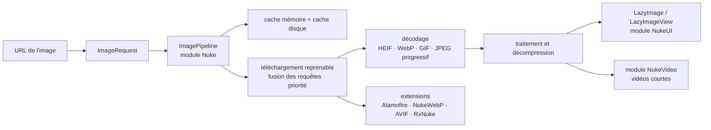

# kean/Nuke

> **Chargement, traitement et cache d'images pour les applications Apple, en Swift.**

## Le problème

Afficher une image distante dans une application iOS ou macOS oblige à recoder chaque fois la
même chaîne : téléchargement, reprise après coupure, décodage, redimensionnement, cache mémoire
puis disque, annulation quand la cellule défile hors de l'écran, et déduplication des requêtes
identiques lancées par plusieurs vues à la fois.

## Ce que ça fait vraiment

Nuke livre un `ImagePipeline` qui va de l'URL à l'image affichée. Le README annonce le détail
de ce que la chaîne prend en charge : cache mémoire et cache disque, traitement et
décompression des images, fusion des requêtes identiques et gestion de priorité, préchargement,
téléchargements reprenables, JPEG progressif, HEIF, WebP, GIF et images animées.

L'API est en async/await : `ImagePipeline.shared.imageTask(with: url)` rend une tâche dont on
lit la progression au fil de l'eau (`for await progress in imageTask.progress`) avant d'obtenir
l'image. Le paquet se découpe en trois modules qu'on installe séparément — **Nuke**, le cœur
(`ImagePipeline`, `ImageRequest`) ; **NukeUI**, les composants d'affichage (`LazyImage` pour
SwiftUI, `LazyImageView` et des extensions `UIImageView` pour UIKit et AppKit) ; **NukeVideo**,
le décodage et la lecture de vidéos courtes.

Le reste est laissé aux extensions : couche réseau Alamofire, WebP et AVIF communautaires,
liaisons RxSwift. Le dépôt contient une application de démonstration (`Nuke.xcodeproj`, schéma
`NukeDemo`) et des guides de migration entre versions majeures.

## Comment c'est branché

Aucun diagramme tiré du code n'existe pour ce dépôt : ce schéma est reconstruit depuis le seul
README, avec les noms de types et de modules qu'il cite.



## Essayer

Le README ne donne pas de ligne de commande : l'installation passe par Swift Package Manager
(option recommandée) ou par les frameworks binaires attachés aux *releases*. Les seuls extraits
copiables sont du code Swift.

```bash
# Aucune commande shell n'est documentée dans le README.
# Installation : ajouter le paquet via Swift Package Manager depuis Xcode.
# Démonstration : ouvrir Nuke.xcodeproj et lancer le schéma NukeDemo.
```

```swift
func loadImage() async throws {
    let imageTask = ImagePipeline.shared.imageTask(with: url)
    for await progress in imageTask.progress {
        // Update progress
    }
    imageView.image = try await imageTask.image
}
```

```swift
struct ContentView: View {
    var body: some View {
        LazyImage(url: URL(string: "https://example.com/image.jpeg"))
    }
}
```

## Coût et pièges

- **Gratuit, licence MIT**, pas de clé d'API, pas de service tiers, pas de compte à créer. Le
  README mentionne un sponsor (Proxyman) sans que l'outil en dépende.
- **Le vrai coût d'entrée est l'écosystème Apple** : il faut Xcode et une chaîne Swift. Le
  README impose Swift 6.2 et Xcode 26.0 pour Nuke 13 et 14, contre Swift 5.7 / Xcode 15 pour
  Nuke 12 — un projet en retard d'outillage reste bloqué sur une version ancienne.
- **Planchers de système** : Nuke 13 exige iOS 15, macOS 12, watchOS 8, tvOS 15, visionOS 1 ;
  Nuke 14 monte à iOS 16 et macOS 13.
- **Branche instable** : le README prévient que Nuke 14 est en développement sur `main` et que
  ses exigences ne sont pas figées. La version publiée est Nuke 13 ; viser les *releases*.
- **Montée de version à préparer** : le dépôt maintient un dossier de guides de migration, ce
  qui signale des ruptures d'API entre majeures.
- **Formats par extension** : WebP et AVIF passent par des paquets communautaires tiers, hors du
  contrôle du dépôt.

## Ce que ce n'est pas

- **Ce n'est pas multiplateforme.** Les plateformes annoncées sont iOS, macOS, watchOS, tvOS et
  visionOS : rien pour Android, le web ou un serveur Linux.
- **Ce n'est pas une bibliothèque de traitement d'images générique.** Le traitement sert la
  chaîne d'affichage (redimensionnement, décompression) ; ce n'est ni de la vision par
  ordinateur ni un outil de retouche hors ligne.
- **Ce n'est pas un projet d'organisation** : le README n'expose qu'un auteur, avec des
  extensions explicitement marquées « Community ». La continuité repose sur une personne.

## Alternatives

| | Quand le préférer |
|---|---|
| **onevcat/Kingfisher** | L'autre bibliothèque de chargement d'images Swift de référence, même périmètre. Le choix se joue sur les habitudes de l'équipe et l'API, pas sur les fonctions. |
| **SDWebImage/SDWebImageSwiftUI** | À préférer si le projet utilise déjà SDWebImage côté UIKit et qu'on veut une couche SwiftUI cohérente avec l'existant. |
| **kean/Pulse** | Cité par le README, complémentaire et non concurrent : à ajouter quand on veut journaliser et inspecter les requêtes réseau, y compris les requêtes d'images. |

Les autres voisins du catalogue (`groue/GRDB.swift`, `dotintent/react-native-ble-plx`) partagent
l'écosystème mobile mais pas le sujet : base de données SQLite et Bluetooth.

## Pour toi

À ignorer pour un profil data, IA ou MLOps : rien ici ne touche aux modèles, aux données ou au
déploiement — c'est de l'infrastructure d'affichage pour applications Apple. Le dépôt n'a
d'intérêt que si tu écris ou revois une application iOS ; sinon, passe ton chemin.
