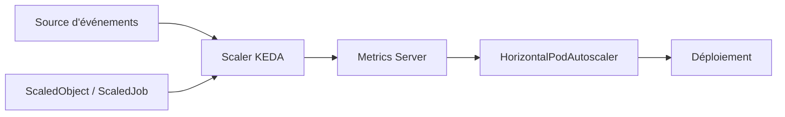

# kedacore/keda

> Autoscaling Kubernetes piloté par les événements, jusqu'à zéro réplique, sans dépendance externe.

## Le problème
Le HPA de Kubernetes ne mesure nativement que CPU et mémoire : une file RabbitMQ qui se remplit
ou une queue de stockage en retard ne déclenchent aucun scaling, et rien ne descend à zéro.

## Ce que ça fait vraiment
KEDA s'installe comme Metrics Server Kubernetes et ajoute une CRD dédiée pour déclarer des règles
d'autoscaling à partir de sources d'événements. Il s'intègre nativement au Horizontal Pod Autoscaler
et fonctionne aussi bien en cloud qu'en edge, sans dépendance externe. Projet **diplômé** de la CNCF.

## Comment c'est branché

## Essayer
Aucune commande n'est donnée dans ce README : il renvoie vers Helm, Operator Hub ou des fichiers YAML,
et vers keda.sh pour la documentation.

## Coût et pièges
Gratuit. Il faut un cluster Kubernetes et un accès à la source d'événements surveillée (file, topic,
stockage) — donc, le cas échéant, un compte cloud et ses quotas.

## Ce que ce n'est pas
Pas un ordonnanceur : KEDA décide du nombre de répliques, c'est le HPA et Kubernetes qui les placent.
Pas un outil GPU ou IA. Le README est essentiellement une table des matières : la matière utile
est ailleurs. Licence non déclarée ici.

## Alternatives
Aucun dépôt alternatif n'est nommé dans le README.

## Pour toi
La brique standard si tes workers d'inférence ou d'ETL doivent suivre une file et tomber à zéro.
