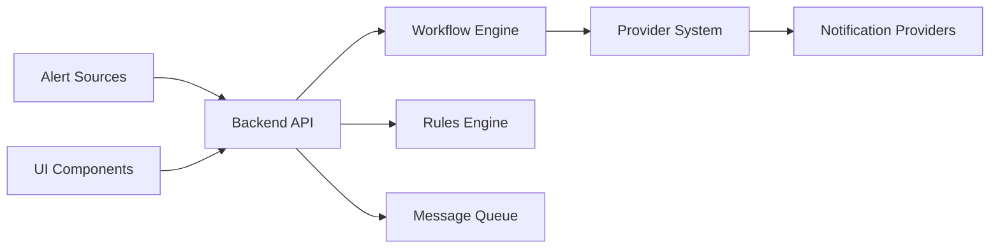

# keephq/keep

> Plateforme ouverte de gestion d'alertes et d'AIOps, agrégeant outils de monitoring et workflows YAML.

## Le problème
Les alertes arrivent de dizaines d'outils de monitoring, en doublons, sans corrélation ni automatisation cohérente.

## Ce que ça fait vraiment
Centralise alertes et incidents dans une UI : déduplication, corrélation, filtrage, enrichissement.
Workflows YAML déclaratifs (triggers, steps, actions) façon GitHub Actions : ex. ticket Jira sur alerte Sentry critique.
Connecteurs : Prometheus, Datadog, Grafana, PagerDuty, Slack, Jira, bases de données, files Kafka/SQS…
Corrélation et résumé par LLM (OpenAI, Anthropic, Ollama, LlamaCPP…).

## Comment c'est branché

## Essayer
Aucune commande dans le README : il renvoie aux guides Docker Compose, Kubernetes, ECS, OpenShift.

## Coût et pièges
Gratuit en auto-hébergement ; les enrichissements IA consomment tes clés LLM.
Licence présente mais non identifiée par GitHub : à vérifier.

## Ce que ce n'est pas
Pas un outil de monitoring : il ne collecte pas de métriques, il consomme les alertes des autres.
L'annonce « Enterprise Ready » (SSO, RBAC) n'est pas détaillée côté édition gratuite.

## Alternatives
Aucune alternative nommée dans le README.

## Pour toi
À surveiller si tu opères des modèles en prod avec plusieurs sources d'alertes : les workflows YAML sont réutilisables, mais vérifie la licence avant.
