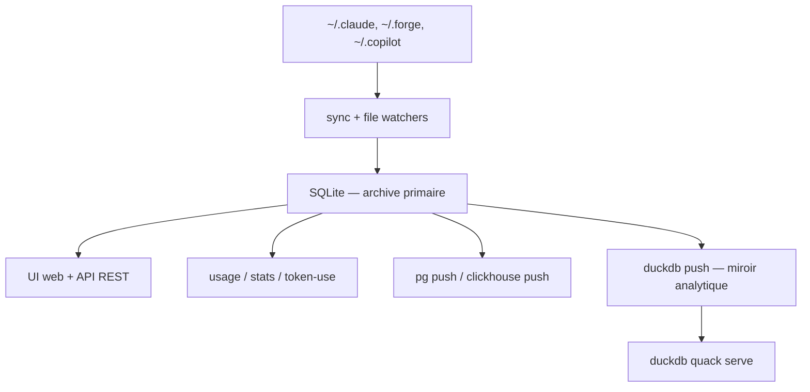

# kenn-io/agentsview

> Archive locale, recherche et comptabilité des sessions de tous tes agents de code.

## Le problème
Chaque agent de code (Claude, Codex, Copilot, OpenCode, Aider, Antigravity) écrit ses sessions dans son propre format, à son propre endroit.
Impossible de retrouver une conversation d'il y a trois semaines, ni de savoir ce que le mois a coûté.

## Ce que ça fait vraiment
Au premier lancement il découvre les sessions de chaque agent présent sur la machine, les synchronise dans un SQLite local et sert une UI web sur `127.0.0.1:8080`.
`agentsview usage daily` calcule le coût par jour, par modèle et par agent, tarifs LiteLLM/OpenRouter avec repli hors ligne, en tenant compte des tokens de cache.
La recherche est plein texte (FTS5, avec segmentation chinoise) et optionnellement sémantique via n'importe quel endpoint d'embeddings compatible OpenAI.
`agentsview stats` sort des analytics fenêtrées en JSON versionné : archétypes de session, distributions de durée, contexte de pointe, économie du cache.

## Comment c'est branché


## Essayer
```bash
curl -fsSL https://agentsview.io/install.sh | bash
agentsview serve           # serveur au premier plan
agentsview daemon start    # ou en arrière-plan
agentsview session list
agentsview usage daily --breakdown
```

## Coût et pièges
Gratuit et local. Le serveur se lie au loopback et valide l'en-tête `Host` : derrière un port-forward SSH ou un proxy, il faut `--public-url`, sinon les appels API tombent en 403.
En Docker, seuls les répertoires que tu montes explicitement sont découverts ; le conteneur tourne en root, donc volume nommé plutôt que bind-mount.

## Ce que ce n'est pas
Ce n'est pas un service : rien ne sort de ta machine tant que tu n'actives pas un push PostgreSQL/ClickHouse ou un export Gist.
DuckDB n'est qu'un miroir en lecture, pas un remplacement de SQLite. Les sessions Aider et JetBrains Copilot demandent un travail manuel (scan opt-in, exporteur tiers).

## Alternatives
- `copilot-jetbrains-exporter` : cité pour exporter les sessions Copilot JetBrains, qu'agentsview ne lit pas directement.
- `mjacobs/agy-reader` : cité pour débloquer les transcripts complets d'Antigravity CLI.

## Pour toi
Adopte-le : c'est le seul endroit où le coût réel de tes agents, tous confondus, devient un chiffre.
