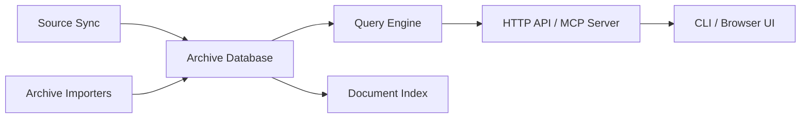

# kenn-io/msgvault

> Archive locale de courriels, chats, réunions, calendriers et contacts, interrogeable par CLI, web ou MCP.

## Le problème
L'historique de communications est dispersé chez plusieurs fournisseurs et difficile à chercher, sauvegarder ou relier aux personnes.

## Ce que ça fait vraiment
Synchronise ou importe messages, réunions, calendriers et contacts vers une base locale (SQLite, DuckDB), avec pièces jointes. Recherche par mots-clés, option sémantique et extraction de texte de documents. Résolution d'identités pour regrouper les adresses d'une même personne, CardDAV, export, sauvegarde et revue de suppressions. Interfaces : navigateur, TUI, CLI, API HTTP, serveur MCP.

## Comment c'est branché


## Essayer
```bash
curl -fsSL https://msgvault.io/install.sh | bash
msgvault init-db
msgvault add-account you@gmail.com
msgvault sync-full you@gmail.com --limit 100
msgvault serve
```

## Coût et pièges
Gmail exige de créer des identifiants OAuth. Les fonctions IA facultatives envoient des données choisies vers les points de terminaison configurés. Logiciel alpha : format de stockage et CLI peuvent changer.

## Ce que ce n'est pas
Pas un client de messagerie ni un service hébergé. La suppression distante est explicite et ne détruit pas l'archive.

## Alternatives
- Aucune alternative nommée dans le README.

## Pour toi
Surveiller : utile pour donner à un agent un accès local à tes courriels, mais alpha et données très sensibles.
