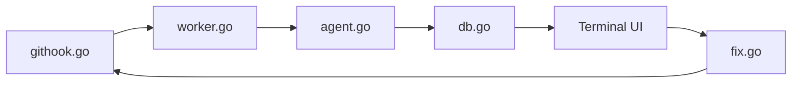

# kenn-io/roborev

> Revue de code continue en arrière-plan, commit par commit, pour ceux qui codent avec des agents IA.

## Le problème
Les agents écrivent du code vite et les défauts s'accumulent avant la revue humaine ; copier les retours d'une revue vers l'agent est manuel.

## Ce que ça fait vraiment
Un hook post-commit met en file chaque commit ; un démon local lance un agent de code (Claude Code, Codex, Gemini, Copilot, etc.) qui relit le diff. Les résultats s'affichent dans un TUI ou une interface web locale. `roborev fix` renvoie les findings à un agent qui corrige et commit, `roborev refine` boucle dans un worktree isolé. Analyses ciblées (duplication, complexité, sécurité…) et export JSON.

## Comment c'est branché


## Essayer
```bash
curl -fsSL https://roborev.io/install.sh | bash
cd your-repo
roborev init
git commit -m "..."
roborev tui
```

## Coût et pièges
Pas de service hébergé, mais chaque revue consomme les quotas ou la facture de l'agent configuré. Télémétrie PostHog anonyme activée par défaut (`ROBOREV_TELEMETRY_ENABLED=0` pour couper). À utiliser sur du code de confiance : sinon, sandbox.

## Ce que ce n'est pas
Pas un linter déterministe : les findings viennent d'un LLM, d'où la commande `compact` pour filtrer les faux positifs. Ce n'est pas une revue de PR hébergée.

## Alternatives
Aucune alternative nommée dans le README.

## Pour toi
À adopter à l'essai : MIT, local, boucle fix/refine concrète pour qui code avec des agents ; vérifie la facture d'agent et coupe la télémétrie si besoin.

