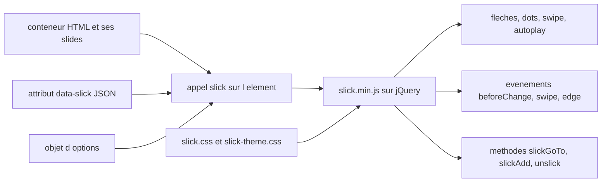

# kenwheeler/slick

> **A configurable jQuery carousel.** For a web front end already running jQuery that needs a tunable slider.

## The problem

Without it you hand-roll the scrolling of a series of elements: touch swipe, resize handling,
navigation dots, auto-play, responsive behaviour per breakpoint. Each piece is tedious and
breaks as soon as the screen width or the number of items changes.

## What it actually does

Turns an HTML container into a carousel through `$(element).slick()`. The README documents
roughly fifty options: `slidesToShow`, `slidesToScroll`, `autoplay` and `autoplaySpeed`,
`infinite`, `fade`, `vertical` and `verticalSwiping`, `centerMode`, `rtl`, `variableWidth`,
`lazyLoad` in `ondemand` or `progressive` mode, `rows` and `slidesPerRow` for a grid mode. The
`responsive` option takes an array of `breakpoint` + `settings`, with the special value
`"unslick"` to disable the carousel below a given width. Settings can also be passed through a
`data-slick` HTML attribute holding JSON. A method API (`slickNext`, `slickPrev`, `slickGoTo`,
`slickAdd`, `slickRemove`, `slickFilter`, `slickSetOption`, `unslick`) and a set of jQuery
events (`beforeChange`, `afterChange`, `swipe`, `edge`, `breakpoint`, `lazyLoaded`,
`lazyLoadError`) round it out. Styling ships separately, with Sass variables such as
`$slick-dot-color`, `$slick-arrow-color` and `$slick-font-path`.

## How it is wired



Two stylesheets and one script are loaded from the CDN or the package: `slick.css` for
structure, `slick-theme.css` for the default look, `slick.min.js` before the closing `<body>`
tag. Initialisation reads the options given in JavaScript or the container's `data-slick`
attribute, then the core drives the display and emits jQuery events; you steer it afterwards
through the methods called on that same instance.

## Trying it

```sh
# Bower
bower install --save slick-carousel

# NPM
npm install slick-carousel
```

Or with no install at all, pointing at the CDN from the page:

```html
<link rel="stylesheet" type="text/css" href="https://cdn.jsdelivr.net/gh/kenwheeler/slick@master/slick/slick.css"/>
<!-- Add the slick-theme.css if you want default styling -->
<link rel="stylesheet" type="text/css" href="https://cdn.jsdelivr.net/gh/kenwheeler/slick@master/slick/slick-theme.css"/>
```

```html
<script type="text/javascript" src="https://cdn.jsdelivr.net/gh/kenwheeler/slick@master/slick/slick.min.js"></script>
```

```javascript
$(element).slick({
  dots: true,
  speed: 500
});
```

## Cost and traps

Free, MIT licensed, no API key and no third-party service. The real cost is the dependency:
jQuery 1.7 at minimum, and a version pairing to watch — the 2.0 line targets jQuery 4 and is
served from `@master`, while jQuery 3.0 or lower forces you to stay on the `@1.8.1` URLs.
Getting that pairing wrong breaks initialisation silently. Another trap: the jsDelivr CDN
pinned to `@master` is not a frozen release. The README advertises IE8+ support, a sign of old
code. Finally the default theme loads an icon font and a loader image whose paths
(`$slick-font-path`, `$slick-loader-path`) must be adjusted if you move the files around.

## What it is not

It is not a standalone component: without jQuery nothing runs, which rules it out of a modern
React, Vue or Svelte codebase without a hand-written wrapper. It is not a general animation
library nor a lightbox gallery either — the README only documents element scrolling and its
navigation. Accessibility is not granted by default: the README states that `focusOnChange`
must be enabled on top of `accessibility` for full compliance. The "the last carousel you'll
ever need" tagline is marketing, not a maintenance commitment.

## Alternatives

The README names no competing project, and no catalogue neighbour was supplied for this repo:
no comparable alternative in the catalogue. The only documented trade-off is internal to the
project — the 2.0 line on `@master` for jQuery 4, 1.8.1 for jQuery 3 and earlier.

## For you

Little direct value for a data / AI / MLOps profile: this is jQuery front-end dressing. The one
plausible use case is a dashboard or demo page already built on jQuery where you want to scroll
through visuals without writing JavaScript. On a recent stack, walk past.
