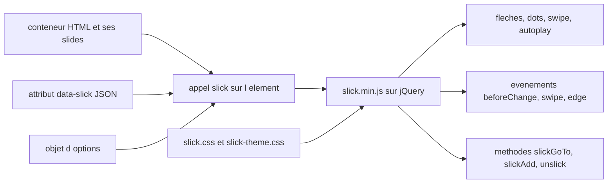

# kenwheeler/slick

> **Carrousel jQuery configurable.** Pour un front web qui vit déjà avec jQuery et veut un slider paramétrable.

## Le problème

Sans lui, on réécrit à la main le défilement d'une série d'éléments : gestion du swipe tactile,
du redimensionnement, des points de navigation, du défilement automatique, du mode responsive
par points de rupture. Chacun de ces morceaux est fastidieux et se casse à la première
variation de largeur d'écran ou de nombre d'éléments.

## Ce que ça fait vraiment

Transforme un conteneur HTML en carrousel via `$(element).slick()`. Le README documente une
cinquantaine d'options : `slidesToShow`, `slidesToScroll`, `autoplay` et `autoplaySpeed`,
`infinite`, `fade`, `vertical` et `verticalSwiping`, `centerMode`, `rtl`, `variableWidth`,
`lazyLoad` en mode `ondemand` ou `progressive`, `rows` et `slidesPerRow` pour un mode grille.
L'option `responsive` prend un tableau de `breakpoint` + `settings`, avec la valeur spéciale
`"unslick"` pour désactiver le carrousel sous une largeur donnée. Les réglages peuvent aussi
passer par un attribut HTML `data-slick` contenant du JSON. Une API de méthodes
(`slickNext`, `slickPrev`, `slickGoTo`, `slickAdd`, `slickRemove`, `slickFilter`,
`slickSetOption`, `unslick`) et un jeu d'événements jQuery (`beforeChange`, `afterChange`,
`swipe`, `edge`, `breakpoint`, `lazyLoaded`, `lazyLoadError`) complètent l'ensemble.
Le thème visuel est fourni à part, avec des variables Sass (`$slick-dot-color`,
`$slick-arrow-color`, `$slick-font-path`…).

## Comment c'est branché



Deux feuilles de style et un script sont chargés depuis le CDN ou le paquet : `slick.css` pour
la structure, `slick-theme.css` pour l'habillage par défaut, `slick.min.js` avant la fermeture
du `<body>`. L'initialisation lit les options passées en JavaScript ou l'attribut `data-slick`
du conteneur, puis le noyau pilote l'affichage et émet les événements jQuery ; on le repilote
ensuite par les méthodes appelées sur la même instance.

## Essayer

```sh
# Bower
bower install --save slick-carousel

# NPM
npm install slick-carousel
```

Ou sans installation, en pointant le CDN dans la page :

```html
<link rel="stylesheet" type="text/css" href="https://cdn.jsdelivr.net/gh/kenwheeler/slick@master/slick/slick.css"/>
<!-- Add the slick-theme.css if you want default styling -->
<link rel="stylesheet" type="text/css" href="https://cdn.jsdelivr.net/gh/kenwheeler/slick@master/slick/slick-theme.css"/>
```

```html
<script type="text/javascript" src="https://cdn.jsdelivr.net/gh/kenwheeler/slick@master/slick/slick.min.js"></script>
```

```javascript
$(element).slick({
  dots: true,
  speed: 500
});
```

## Coût et pièges

Gratuit, licence MIT, pas de clé d'API ni de service tiers. Le vrai coût est la dépendance :
jQuery 1.7 au minimum, et un branchement de version à surveiller — la 2.0 vise jQuery 4 et
s'installe depuis `@master`, tandis que jQuery 3.0 ou inférieur impose de rester sur les URL
`@1.8.1`. Se tromper de couple de versions casse silencieusement l'initialisation. Autre piège :
le CDN jsDelivr pointé sur `@master` n'est pas une version figée. Le README annonce le support
d'IE8+, signe d'un code ancien. Enfin le thème par défaut charge une police d'icônes et une
image de loader dont les chemins (`$slick-font-path`, `$slick-loader-path`) doivent être
réajustés si l'on déplace les fichiers.

## Ce que ce n'est pas

Ce n'est pas un composant autonome : sans jQuery, rien ne fonctionne, ce qui l'exclut de fait
d'une base React, Vue ou Svelte moderne sans emballage maison. Ce n'est pas non plus une
bibliothèque d'animation générale ni une galerie lightbox — le README ne documente que le
défilement d'éléments et sa navigation. L'accessibilité n'est pas acquise par défaut : le
README précise qu'il faut activer `focusOnChange` en plus de `accessibility` pour une
conformité complète. Le slogan « the last carousel you'll ever need » est du marketing, à ne
pas lire comme un engagement de maintenance.

## Alternatives

Le README ne nomme aucun projet concurrent, et aucun voisin de catalogue n'a été fourni pour ce
dépôt : aucune alternative comparable dans le catalogue. Le seul arbitrage documenté est interne
au projet — la ligne 2.0 sur `@master` pour jQuery 4, la 1.8.1 pour jQuery 3 ou antérieur.

## Pour toi

Peu d'intérêt direct pour un profil data / IA / MLOps : c'est de l'habillage front jQuery. Le
seul cas d'usage plausible est un tableau de bord ou une page de démonstration déjà bâtie sur
jQuery où l'on veut faire défiler des visuels sans écrire de JavaScript. Sur une stack récente,
passer son chemin.
