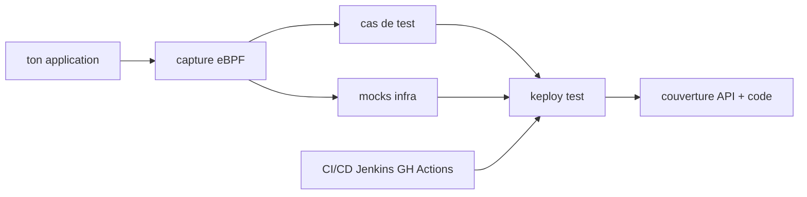

# keploy/keploy

> Génère tests d'API et mocks à partir du trafic réel, sans SDK ni modification de code.

## Le problème
Écrire des tests d'intégration réalistes demande de simuler bases, files et API externes, une par une.
Le résultat vieillit vite, et personne ne le maintient une fois la fonctionnalité livrée.

## Ce que ça fait vraiment
Capture le trafic au niveau réseau via eBPF, puis le rejoue comme tests : aucune bibliothèque à importer.
Enregistre aussi les bases (Postgres, MySQL, MongoDB) et les files (Kafka, RabbitMQ), pas seulement HTTP.
Calcule à la fois la couverture d'instructions et de branches, et la couverture de schéma d'API.
Utilise les enregistrements et un schéma Swagger/OpenAPI pour générer des cas limites supplémentaires.

## Comment c'est branché


## Essayer
```bash
curl --silent -O -L https://keploy.io/install.sh && source install.sh
keploy record -c "python main.py"
keploy test -c "CMD_TO_RUN_APP" --delay 10
```

## Coût et pièges
eBPF implique un noyau Linux et des privilèges d'interception réseau : à valider avant de l'installer.
Le README indique que certaines dépendances aux protocoles non ouverts ne sont pas supportées côté entreprise.

## Ce que ce n'est pas
Pas un remplaçant des tests unitaires : il rejoue des parcours réels, il ne teste pas une fonction isolée.
Pas entièrement ouvert sur le périmètre : une partie relève d'une édition entreprise.
Pas un outil de charge : il déterminise des scénarios enregistrés, il ne les multiplie pas.

## Alternatives
Aucune nommée dans le README.

## Pour toi
Intéressant pour figer le comportement d'une API de scoring avant refonte ; à tester hors prod d'abord.
