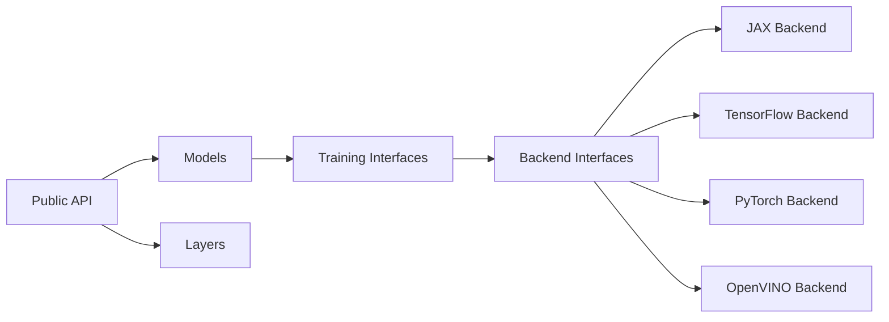

# keras-team/keras

> Framework de deep learning de haut niveau qui tourne sur JAX, TensorFlow, PyTorch ou OpenVINO.

## Le problème
Choisir un framework de deep learning enferme le code : passer de TensorFlow à JAX ou PyTorch oblige à tout réécrire.

## Ce que ça fait vraiment
Une même API (modèles, couches, entraîneurs, pertes, métriques, callbacks) s'appuie sur une couche d'abstraction (`keras/src/backend`, `keras/src/ops`) implémentée par chaque backend. Le backend se choisit par `KERAS_BACKEND` ou `~/.keras/keras.json`, avant l'import.
Un modèle Keras peut s'entraîner dans une boucle écrite en TF, JAX ou PyTorch natif, ou s'insérer dans un `Module` PyTorch. Il accepte `tf.data` comme `DataLoader`. Remplace `tf.keras` sans changement avec le backend TensorFlow.

## Comment c'est branché


## Essayer
```bash
pip install keras --upgrade
export KERAS_BACKEND="jax"
pip install -r requirements.txt
python pip_build.py --install
```

## Coût et pièges
Gratuit, Apache-2.0. Le backend (tensorflow, jax ou torch) s'installe à part ; Windows via WSL2. Le backend ne change plus après l'import.

## Ce que ce n'est pas
OpenVINO ne sert qu'à l'inférence (`model.predict()`). Les composants maison (couches, `train_step()`) demandent une conversion pour devenir multi-backend. Les gains de vitesse annoncés (20 à 350 %) viennent d'un benchmark de l'éditeur.

## Alternatives
- tf-keras — Keras 2, pour du code `tf.keras` ancien qu'on ne veut pas migrer.

## Pour toi
À adopter si tu veux du code de modèle indépendant du backend, surtout pour tester JAX.
