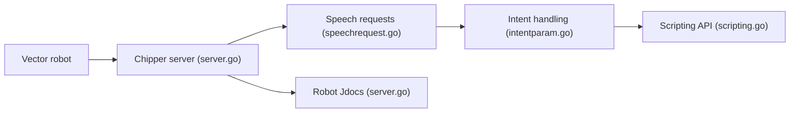

# kercre123/wire-pod

> Serveur qui rend les commandes vocales du robot Anki/DDL Vector fonctionnelles sans abonnement.

## Le problème
Le robot Vector perd ses commandes vocales sans le service cloud officiel.

## Ce que ça fait vraiment
Remplace le serveur vocal : le robot envoie la parole, un reconnaisseur choisi alimente la gestion d'intentions et les réponses ; gère aussi Jdocs, jetons, configuration, localisation et API de script. Le dépôt contient aussi un runtime cloud et une passerelle RPC. Installation et détails renvoyés au wiki.

## Comment c'est branché


## Essayer
```bash
# Aucune commande dans le README : l'installation est décrite dans le wiki.
```

## Coût et pièges
Gratuit ; un robot Vector est nécessaire. Procédure d'installation hors README.

## Ce que ce n'est pas
Pas une application générale de reconnaissance vocale : elle ne sert qu'à Vector. README très court (credits, don).

## Alternatives
Aucune alternative nommée dans le README.

## Pour toi
À ignorer : utile uniquement aux propriétaires d'un robot Vector, sans transfert pour un profil data/IA.

