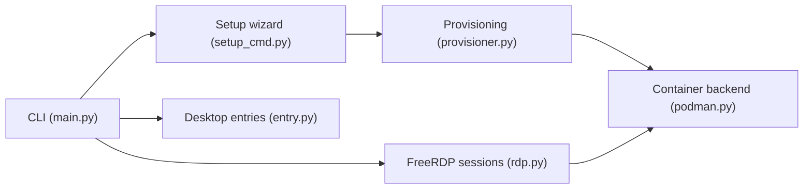

# kernalix7/winpodx

> Lance des applications Windows comme fenêtres Linux natives via FreeRDP RemoteApp sur un conteneur Windows.

## Le problème
Utiliser Word ou d'autres applis Windows sous Linux sans dual boot ni bureau Windows plein écran.

## Ce que ça fait vraiment
- Provisionne Windows 11 dans Podman ou Docker (dockur/windows), découvre les applis et crée des entrées de bureau.
- Chaque appli s'ouvre dans sa propre fenêtre ; presse-papiers, audio, imprimantes et dossier personnel partagés.
- Met la VM en pause à l'inactivité ; GUI, tray, passthrough USB/PCI.
- Statut « Beta », v0.11.0 ; Python 3.10 minimum.

## Comment c'est branché


## Essayer
```bash
curl -fsSL https://raw.githubusercontent.com/kernalix7/winpodx/main/install.sh | bash
winpodx setup
winpodx app run word
winpodx gui
```

## Coût et pièges
Virtualisation matérielle (VT-x/AMD-V, KVM), 8 Go de RAM (12 recommandés), disque Windows de 64 Go plus ISO. Une licence Windows reste à ta charge. Installation par `curl | bash`.

## Ce que ce n'est pas
Pas de l'émulation Wine : une vraie VM Windows tourne en arrière-plan. Pas pour GPU lourd.

## Alternatives
Le README cite winapps, LinOffice, winboat et Wine (fichier COMPARISON.md).

## Pour toi
À surveiller : pratique si tu dois ouvrir des outils Windows depuis un poste Linux, mais coûteux en ressources et encore en bêta.

